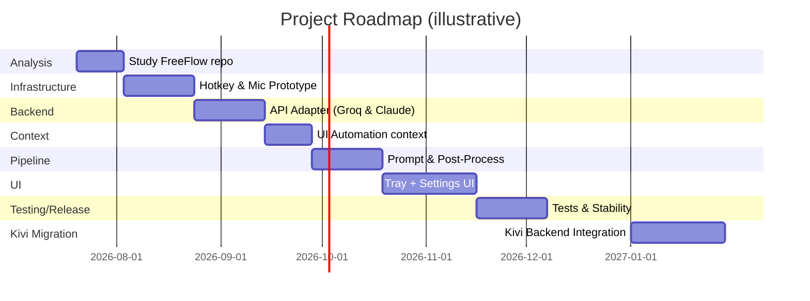

# Executive Summary

We recommend keeping **FreeFlow’s AI and prompt logic as-is** and building a thin Windows-native wrapper around it.  In practice, this means porting the **infrastructure** (hotkeys, audio I/O, clipboard, UI Automation, etc.) to .NET, but reusing FreeFlow’s core logic and prompts.  A good design is an adapter pattern: e.g. a `DictationController` drives modules for hotkeys, mic capture, context gathering and a pluggable `IBackendProvider`.  Today `IBackendProvider` can wrap the FreeFlow/OpenAI (Groq) API calls; tomorrow it can point at a Kivi service.  This **preserves FreeFlow’s AI/prompt pipeline verbatim** (minimizing code rewrite) while making all OS integrations modular. 

Below we validate this **wrapper/adapter architecture**, flag pitfalls, and outline a phased roadmap.  We map each macOS API FreeFlow uses to the Windows equivalent, survey transcription and LLM backends (Claude/Anthropic, Groq/OpenAI, Kivi), and lay out interfaces so the backend can swap transparently.  We cover streaming vs batch audio transcription, security (encrypting keys, not logging data), performance (latency, memory, threading), testing, deployment (installer, tray app, permissions), and the migration to a Kivi backend.  The plan assumes a C#/.NET implementation on modern Windows (10/11), with standard CI/CD and build tools.  We cite FreeFlow’s repository and official docs where possible to ground our recommendations (for example, FreeFlow notes “the only information that leaves your computer are API calls to your configured transcription and LLM provider”, underscoring our privacy strategy).  

# 1. Proposed Architecture (Validate & Refine)

We believe the **adapter-wrapper architecture** described in your plan is sound.  The goal is to avoid rewriting FreeFlow’s logic, instead rehosting it in .NET with pluggable system interfaces.  A conceptual diagram is:

```mermaid
flowchart LR
    subgraph Windows Wrapper
        direction TB
        UI[Kivi-Style UI] --> DictationController
        DictationController --> HotkeyModule
        DictationController --> AudioCapture
        DictationController --> ContextGathering
        DictationController --> ClipboardOutput
        ContextGathering --> Accessibility
        Accessibility --> UIAutomation
        AudioCapture --> MicStream
        DictationController --> BackendAdapter
        BackendAdapter --> FreeFlowAPI[FreeFlow/Groq/OpenAI API]
        BackendAdapter --> ClaudeAPI[Anthropic Claude API]
        BackendAdapter --> KiviService[Kivi Service API (future)]
    end
```

- **HotkeyModule**: captures the global shortcut (e.g. Ctrl+Space or Fn key) and notifies the controller. On Windows this uses the Win32 `RegisterHotKey` API or a managed library (e.g. GlobalHotKeys).  
- **AudioCapture**: records microphone audio (e.g. via NAudio or Windows.Media.Audio) and feeds raw PCM to the transcription service. NAudio is a mature C# library that supports WASAPI input with example code.  
- **Accessibility/ContextGathering**: reads nearby UI text for context. On macOS FreeFlow uses Apple’s AX APIs; on Windows we use **UI Automation** (`System.Windows.Automation`) to read text from active controls via `TextPattern`/`ValuePattern`.  
- **DictationController**: orchestrates the above, builds prompts, calls the LLM, and pastes output.  (Pasting can use the Windows Clipboard API, e.g. `Clipboard.SetText`.)  
- **BackendAdapter**: an interface (e.g. `IBackendProvider`) that encapsulates API calls.  Today it wraps the FreeFlow/OpenAI (Groq) endpoints; later it can point at Claude’s API or a custom Kivi service.  

This pattern ensures *only one component* (the BackendAdapter) needs to change when switching LLM services. The UI (settings panel, tray icon, notifications) and core pipeline (transcribe audio → cleanup via LLM → paste) remain identical, which minimizes risk.  

## FreeFlow Core Logic to Keep vs Reimplement

FreeFlow’s repository has many Swift/SwiftUI files. We propose reusing the **core logic and prompt pipelines**; rewriting only the OS-specific parts.  Below is a rough **file-by-file mapping checklist** (note: paths from the FreeFlow repo):

- **Keep (re-implement in C#)**: 
  - **Core controllers**: e.g. `DictationShortcutSessionController.swift`, `ShortcutMatcher.swift` (handle hold/toggle logic).
  - **Transcription logic**: `RealtimeTranscriptionService.swift`, `TranscriptionService.swift` (streaming and non-streaming audio API calls).
  - **Post-processing / prompt pipeline**: `PostProcessingService.swift` (builds system/user messages, calls LLM), plus supporting classes like `VocabularyNotificationManager.swift`, `AppContextService.swift` (collects context text).  
  - **ModelConfiguration / prompts**: Constants for default model IDs, temperature, reasoning flags, etc. E.g. `ModelConfiguration.swift`.  
  - **Vocabulary logic**: handling custom user vocabulary list (`AppState+AddVocabularyButton.swift`, vocabulary sorting).  
  - **Settings, history, persistence**: any logic for storing settings or past transcripts (except **KeychainStorage** must be re-implemented with Windows secure storage).  

- **Replace (Windows-specific)**:
  - **Hotkeys**: `LocalShortcutCaptureBackend.swift`, `GlobalShortcutBackend.swift`, `HotkeyManager.swift`.  On Windows use `RegisterHotKey` or a library (see [33]) instead of MASShortcut.  
  - **Audio I/O**: `AudioRecorder.swift`, `LiveAudioLevelNormalizer.swift`. Replace with NAudio or MediaFoundation code for capturing mic data.  Use a buffer and feed to the transcription service.  
  - **Clipboard & paste**: FreeFlow likely uses NSPasteboard; Windows uses `Clipboard` classes.  To simulate typing, we can optionally send keystrokes (e.g. via `SendInput`) but simpler is just `Clipboard.SetText` then send Ctrl+V.  
  - **Accessibility (Context)**: macOS uses AppKit AX; Windows uses UI Automation (`AutomationElement`, `TextPattern`, `ValuePattern`). We must skip password fields and handle focus.  
  - **Tray UI and preferences**: SwiftUI views (`MenuBarView.swift`, `SettingsView.swift`, etc.) need a WPF or WinForms UI.  That’s a full rewrite of UI, which is OK. We only reuse the UI logic in patterns (e.g. ViewModels reflecting `AppState`).  
  - **Keychain storage**: `KeychainStorage.swift` must map to Windows DPAPI or Credential Manager (e.g. `ProtectedData` or `Windows.Security.Credentials`) for storing API keys/passwords securely.  

Every other algorithmic piece (prompt construction, cleanup rules, even the example pipeline debug code) can be translated fairly directly, since it’s language-agnostic.  The most critical part is that **prompts remain identical**, so the Windows app behaves like FreeFlow.  Don’t re-jigger the AI logic in this pass—parity first, then optimize.  

# 2. File-By-File Mapping Checklist

| FreeFlow File | Purpose | Windows Equivalent / Action |
|---------------|---------|----------------------------|
| `ShortcutCore/DictationShortcutSessionController.swift` | Orchestrates hold/toggle key logic | Re-implement in C#; could be part of `HotkeyManager` logic. |
| `ShortcutCore/ShortcutMatcher.swift` | Matches key combinations to dictation modes | Reuse logic; port to C#. |
| `AudioRecorder.swift` | Records mic audio to buffer | Replace with NAudio/MediaFoundation code capturing PCM. |
| `RealtimeTranscriptionService.swift` | Sends audio to streaming STT (OpenAI/Groq) via websocket | Port logic but likely use REST or gRPC (Anthropic doesn’t yet support real-time STT). We may use batch Whisper API instead. |
| `TranscriptionService.swift` | Non-streaming STT fallback | Use OpenAI/Vosk/Google/AssemblyAI APIs. Create a similar class in C# calling REST. |
| `PostProcessingService.swift` | Builds prompts and calls LLM, handles responses | Port as-is to C#: same HTTP calls (Anthropic endpoint vs OpenAI-style). Adapt JSON payloads to Anthropic if needed. |
| `AppContextService.swift` | Gathers UI context (text around cursor) | Re-implement with UI Automation: use `AutomationElement.FromPoint` or focus, then `TextPattern` to read text. |
| `VocabularyNotificationManager.swift` | Adds new vocabulary from context or user | Keep logic; store in local file or settings. |
| `KeychainStorage.swift` | Securely stores API keys | Replace with Windows DPAPI (`ProtectedData`) or credential vault. |
| `SettingsView.swift`, `MenuBarView.swift`, etc. | UI for preferences | Complete rewrite in WinForms/WPF/WinUI. |
| `GlobalShortcutBackend.swift` | mac global hotkey hook | Use Win32 `RegisterHotKey` (Win32 apps) or a NuGet (e.g. [GlobalHotkeys][32], [LostInDetails][32]). Cite: Microsoft docs. |
| `LiveAudioLevelNormalizer.swift` | (mac) normalizes audio levels during recording | Optional: can smooth volume levels; may skip or use an AudioMetering from NAudio if needed. |
| **KEEP**: Prompt strings (e.g. default “clean up RAW_TRANSCRIPTION” prompt) | – | Direct copy into C# code. |
| **KEEP**: Vocabulary pipeline, macros, context insertion rules | – | Port this logic (likely in `PostProcessingService`). |

Any file involving SwiftUI views will be replaced.  Non-UI logic (almost all of `PostProcessingService`, `RealtimeTranscriptionService`, etc.) is portable as C# classes with minimal change aside from HTTP details (URI, JSON fields for Claude vs OpenAI).

# 3. Implementation Roadmap (Phased, with Effort)

We suggest breaking the work into these phases.  **Estimate** (very roughly) per phase:
1. **FreeFlow Analysis (1–2 weeks)** – *Study first, code later.* Read every Swift file to fully understand workflows: hotkey modes, audio buffering, transcription calls, prompt assembly, paste behavior, vocab management, etc. No coding yet – write documentation/mapping. (Complexity: low, but crucial for correctness.)  
2. **Windows Bootstrapping (2–3 weeks)** – **Prototype I/O and hotkey**.  Build a minimal .NET app (console or WinForms) that: registers a global hotkey (e.g. Ctrl+Space), starts/stops microphone recording (with NAudio WASAPI), and pastes dummy text via Clipboard. This validates OS permissions, audio API, and paste. (Challenges: microphone permission dialog on Win10+, getting raw PCM, correct WAV format).  
3. **Backend Adapter (2–3 weeks)** – Define `IBackendProvider`. Implement a **FreeFlowProvider** that calls FreeFlow’s groq endpoint (REST), and test the full voice→AI→text loop using a dummy or test API. Ensure correct JSON (e.g. POST to `/chat/completions` with the FreeFlow prompt format). Then create a **ClaudeProvider** (using Claude REST API). For Claude, use `/v1/messages` with `x-api-key` and `anthropic-version` headers (Anthropic docs) and handle SSE streaming if desired. Verify raw output (no UI yet). (Complexity: medium; handle threading for async HTTP/SSE).  
4. **Context & Accessibility (2 weeks)** – Implement App Context: use **UI Automation** to read text around the cursor. For example, get the active window’s AutomationElement, then use `TextPattern.DocumentRange.GetText` or inspect nearby controls. *Important:* FreeFlow reads context to correct spelling of names etc.. Also prepare `ContextProvider` to format context strings for prompts. This step may need tweaks (skipping hidden fields, etc.). (Complexity: high; UIA can be finicky.)  
5. **Prompt Pipeline & Post-Processing (2–3 weeks)** – Port the entire cleanup pipeline. Build the system+user prompt exactly as FreeFlow does (see [24] lines) including vocabulary injection. Hook up the audio transcript into it. Call the selected backend, parse JSON. Return final text and paste it (or raise events for UI to show). Implement fallback logic if API fails (like FreeFlow’s retry and cooldown timers). (Complexity: high; needs careful JSON parsing of chat vs Anthropic streaming SSE).  
6. **UI & Polish (2–4 weeks)** – Develop the user interface: tray icon (NotifyIcon or WPF Notify), settings dialog (choose shortcuts, model, API keys, languages), status notifications (Windows Toasts or NotifyIcon balloon), and a pipeline debug/history view if needed. Apply Kivi branding (colors/animations) only after core is solid. (Complexity: medium; mainly productivity/Ux work.)  
7. **Testing & Stabilization (2–3 weeks)** – Write **unit tests** for core logic (e.g. prompt builder, JSON parsing, config). Write **integration tests** simulating a full audio->text run (with mocked HTTP). Perform manual tests with actual microphone. Test on different Windows versions (10,11). Ensure installer including proper prerequisites (e.g. microphone permission) and that the app can run from startup or tray reliably. (Complexity: medium; important for reliability.)  
8. **Migration to Kivi (future)** – Once `sarvam-kivi-service` is available, implement a `KiviProvider` that calls its endpoints. Ideally, it matches `IBackendProvider`. Minimal code changes should be needed elsewhere (just swapping provider). (Complexity: unknown—depends on Kivi API spec, but should be straightforward if the adapter interface was designed flexibly.)  

A high-level Gantt timeline (month units) might look like:



(*Phases may overlap. Durations are approximate and should be adjusted based on team size and risk appetite.*)

# 4. Prioritized Research Agenda

Before/during implementation, we recommend researching these topics (in roughly this order):

1. **Claude API specifics**: Find Claude API endpoints, request formats, key auth, rate limits. Check if Streaming SSE is needed or if we do simpler sync calls. (Anthropic docs via [21] or [17] for `/v1/messages`.) Confirm support for Claude 4.5 or the latest. Understand how to set `max_tokens` and `stream:true`.  
2. **Windows global hotkey libraries**: Evaluate `RegisterHotKey` vs wrapper libs (e.g. [32]). Some libraries handle multiple hotkeys easily. Identify nuances (only on UI thread, unregistration, avoiding conflicts).  
3. **Microphone capture latency vs buffer size**: NAudio’s `WasapiCapture` vs `WaveInEvent`, choosing correct sample rate (likely 16000 Hz mono for Whisper/OpenAI). Confirm how to chunk audio into frames (e.g. 5–10 sec) for batching if not streaming.  
4. **Speech-to-text options**: FreeFlow uses Groq (OpenAI-like). If using Claude (LLM) we still need STT: likely call a separate STT service (OpenAI Whisper API, Azure Speech, or Groq). Determine whether to stream or do  audio recording + one-shot transcription.  
5. **UI Automation for context**: Identify the best strategy to grab the nearest editable/control text. For instance, use the Windows UIA `TextPattern` or `ValuePattern` on the window under cursor. Handle exceptions (some apps may not support UIA). Possibly use the active window’s title or accessible name as fallback.  
6. **Clipboard vs input injection**: Decide whether to paste via Clipboard or simulate keypresses. Clipboard is simpler but loses current clipboard data (freeflow likely replaced it). Alternative: temporarily save and restore clipboard data. Also confirm how to safely send “ENTER” or formatting.  
7. **Authentication/Secrets**: Decide where to store the API key securely. Options: Windows Credential Locker (via `CredentialManager`), DPAPI encryption (`ProtectedData`), or user-scoped secrets file. Ensure no plaintext in config.  
8. **Performance tuning**:  E.g. how to minimize transcription latency: maybe send audio frames to Whisper continuously. Check if NAudio allows pulling small buffers to mimic “streaming.” Also consider parallelism: run transcription and LLM in background tasks so UI stays responsive.  
9. **Security/Privacy**: Beyond encryption (above), consider whether to anonymize transcripts. FreeFlow’s promise: *“no FreeFlow server… only API calls to providers”*. Ensure we don’t log or save the audio or keys locally. Possibly ask Claude for privacy rules (some open prompts disclaimers).  
10. **Installer/Deployment**: Research packaging tools (MSIX, WiX, Squirrel). The app likely needs to auto-start on login (for global hotkey). Also ensure proper manifest for microphone access.  
11. **Kivi Service API**: Although details are unknown, gather any specs (endpoint URL, auth). Plan for an abstract interface so switching is config-driven.

Throughout, capture your findings in a living doc.  Emphasize official sources (Anthropic docs, Microsoft docs, FreeFlow source) for design decisions.

# 5. Recommended Libraries & Tools

- **Hotkey**: Use Win32 `RegisterHotKey` (via P/Invoke) or a .NET library like [GlobalHotKeys](https://github.com/kirmir/globalhotkeys) for easier management.  
- **Audio Capture**: **NAudio** (C# audio library), specifically `WasapiCapture` or `WaveInEvent`. It handles diverse hardware. For simplicity, start with WaveIn (shared mode) or WasapiCapture (exclusive mode) as shown in Mark Heath’s examples.  
- **JSON/HTTP**: `System.Net.Http.HttpClient` for REST calls. For Anthropic SSE, you may use `HttpClient` with `GetAsync` and read line-by-line, or an SSE library. (Alternatively, [SSESharp](https://github.com/Redth/SSESharp) or manually parse).  
- **UI Automation**: .NET’s built-in **UI Automation API** (`System.Windows.Automation` namespace). Use `AutomationElement` to find controls and `TextPattern` or `ValuePattern` to read/write.  
- **JSON Parsing**: `Newtonsoft.Json` or `System.Text.Json` to decode responses. (FreeFlow uses simple deserialization of `choices[0].message.content`.)  
- **Tray/GUI**: For a modern look, WPF or WinUI 3 (with `NotifyIcon`). For a quick solution, WinForms’ `NotifyIcon` can show a tray icon and context menu.  
- **Secure Storage**: Windows Data Protection API (`System.Security.Cryptography.ProtectedData`) to encrypt keys. Or [CredentialManager](https://www.nuget.org/packages/CredentialManager) (NuGet) to store in Windows Credentials vault.  
- **Logging**: Use a logging framework (e.g. [Serilog](https://serilog.net/)) but ensure it does **not** log sensitive transcript content.  
- **Prompt Engineering**: None needed beyond copy from FreeFlow. But document how the prompts are built (e.g. system vs user in [24†L3244-L3254]).  

# 6. MacOS vs Windows API Mapping

| macOS (FreeFlow)               | Windows Equivalent                         | Comments                                  |
|--------------------------------|--------------------------------------------|-------------------------------------------|
| **Global Shortcut** (`LocalShortcutCaptureBackend.swift`) | `RegisterHotKey` (Win32) or libraries (GlobalHotkeys) | Win32 `RegisterHotKey(NULL, id, modifiers, vk)` posts `WM_HOTKEY` (see [33] example). Remember unregistration. |
| **Audio capture** (`AudioRecorder.swift`) | NAudio (WaveIn or WasapiCapture) | Use NAudio demo for microphone capture (WASAPI low-latency). Then format PCM to feed API. |
| **UI Paste** (NSPasteboard)   | `System.Windows.Clipboard` or `Clipboard` class | E.g. `Clipboard.SetText(cleanedText)` then send Ctrl+V keystroke if needed. |
| **Accessibility / Context**   | UI Automation (`AutomationElement`, `TextPattern`, `ValuePattern`) | Use `TextPattern.GetText` to read control text. Use `ValuePattern.SetValue` or keyboard input to insert. Skip password controls. |
| **Secure storage** (`KeychainStorage.swift`) | Windows Credential Manager or DPAPI (`ProtectedData`) | Store API keys with DPAPI: e.g. `ProtectedData.Protect( keyBytes, null, CurrentUser )`. |
| **Notification** (`NSNotification`, UI banners) | Windows Toast or NotifyIcon balloons (`NotifyIcon.ShowBalloonTip`) | Using `System.Windows.Forms.NotifyIcon` in WinForms/WPF for simple toasts. |
| **Global Audio Output Status** (`SystemAudioStatus.swift`) | Endpoint volume/mute: N/A or via CoreAudio (complex) | Optional: skip. Controlling system mute is advanced on Windows. |
| **Tray/Menu bar** (`NSStatusBar` in AppDelegate) | `NotifyIcon` in WinForms/WPF | Standard system tray icon; same concept. |

# 7. Backend Options Comparison

Below we compare **Claude (Anthropic)** vs **Groq/OpenAI (FreeFlow)** vs **Kivi service** as possible “backends” for both transcription and LLM. We consider key factors:

| Aspect               | Claude (Anthropic)                       | Groq/OpenAI (FreeFlow)               | Sarvam-Kivi Service                 |
|----------------------|------------------------------------------|--------------------------------------|-------------------------------------|
| **Service Type**     | LLM (chat) – no native STT; uses chat API (messages endpoint) | OpenAI-compatible (Groq) – FreeFlow’s default STT + LLM | Custom (likely chat or unified AI)  |
| **API Model Names**  | e.g. `claude-opus-4-5`                   | e.g. `groq/whisper` for STT, `gpt-4o` for LLM | TBA (unknown until release)         |
| **Streaming**        | SSE events supported (`stream: true`) (Anthropic’s SSE uses events like `message_start`, `content_block_delta`) | SSE supported (`stream: true`) – OpenAI SSE format with `data: {…}` chunks (FreeFlow’s Swift uses WebSocket for Whisper) | Unknown; likely SSE or REST        |
| **Batch vs Real-Time Transcription** | Must use external STT (e.g. Whisper HTTP API, AssemblyAI, Azure) – no built-in streaming LLM voice mode. | FreeFlow uses Groq Whisper (WebSocket streaming) or OpenAI audio API (batch). Streaming available via WebSocket as in [14]. | Might integrate with a transcription engine or handle speech differently.  |
| **Latency**         | **First-token ~1.1s** (Claude 2 in one test); streaming tokens arrive in bursts (ping/content events). Complex multi-event format. | **GPT-4** slower (varying; e.g. GPT-3.5 first ~0.9s). Groq/Whisper latency depends on chunking; OpenAI Whisper typically ~1–2s. | Unknown; likely optimized. We'll measure later. |
| **Cost**           | (As of 2026) ~ $3.00 per 1M tokens for Claude 4.5 (prompt+completion) on **Anthropic** API (estimate). *No free tier.* | Whisper: free via Groq? (FreeFlow default); LLM: Groq-2B on free tier or OpenAI at ~$2-$6 per million tokens (gpt-4 ~ $6k per 1M). OpenAI billable. | TBD. Possibly internal pricing or free if on-prem. |
| **Auth**           | Requires `x-api-key` header, `anthropic-version` (e.g. 2023-06-01). | `Authorization: Bearer YOUR_KEY`. (FreeFlow lets users set custom `baseURL` and token.) | Likely OAuth or API key. Details needed. |
| **Integration Effort** | Medium: JSON is slightly different (Anthropic uses chat messages vs OpenAI chat). Streaming parse differs (Anthropic SSE). Libraries exist (no official .NET SDK). | Low to medium: FreeFlow’s code already uses OpenAI-style HTTP. .NET also has OpenAI SDKs. Streaming OpenAI SSE and WebSockets (for Whisper) are well documented. | Unknown: depends on Kivi API design. But if an OpenAI-style service, integration could reuse much. |
| **Privacy**         | Anthropic claims no training on customer data by default. (Check latest policy). Uses voice? N/A. | Data privacy as per Groq/OpenAI terms. FreeFlow emphasizes local-only (calls just API). | Likely controlled by your organization (could be on-prem). |
| **Notes**           | Anthropic has speech mode in Claude Code apps (closed system) but no public STT. We must pair it with a transcription API. SSE requires parsing `event:` lines. | FreeFlow already supports a “provider” system for OpenAI-compatible models, so hooking Claude is conceptually similar. Whisper streaming is via WebSockets (FreeFlow’s code uses binary audio frames). | We will design for this: if Kivi uses a chat API, just add a new provider class. Use interface to abstract out API differences. |

# 8. Security & Privacy Considerations

- **No Storage of Sensitive Data**: Emulate FreeFlow’s privacy promise – do **not log** or upload transcripts or audio anywhere except the configured APIs. If storing history locally, ensure it’s encrypted or opt-in.  
- **Secure Credentials**: Store API keys securely (DPAPI or Windows Vault). If writing to disk (e.g. settings JSON), encrypt fields. Avoid plaintext config files.  
- **Network Encryption**: Use HTTPS for all API calls. Verify SSL certificates (default `HttpClient` does).  
- **Minimal Permissions**: The app needs microphone permission; avoid requiring admin or file system access beyond its config directory. If running at startup, explain why in installer to avoid UAC.  
- **User Consent**: At first run, clearly ask for microphone access and show that data is sent only to the AI provider (like FreeFlow’s Privacy section). Possibly offer a toggle for privacy mode (e.g. do not add context, do not log anything).  
- **Data Retention**: Do not cache or retain audio. Once transcription is done, wipe the buffer. Allow user to clear history.  
- **Failure Mode**: If backend returns an error, don’t paste garbage. Possibly prompt “retry” or silently do nothing (as FreeFlow does by returning “EMPTY” for no output).  
- **Open Redirect Prevention**: If using custom API URLs (like FreeFlow allows baseURL override), ensure the URL is validated. Don’t inadvertently allow proxying to malicious endpoints.

A handy privacy checklist (paralleling FreeFlow’s points): 

- [ ] **Local Processing**: All cleanup happens via local code; only API calls are outgoing.  
- [ ] **Encrypted Storage**: Keys are encrypted at rest (e.g. `ProtectedData`).  
- [ ] **Minimal Transmissions**: Only transcript text and possibly context are sent out. No audio or sensitive UI content.  
- [ ] **No Tertiary Calls**: Do not chain calls to unknown services; restrict `IBackendProvider` to approved endpoints.  
- [ ] **User Control**: Settings allow enabling/disabling things like context or history.  

# 9. Testing Plan

**Unit Tests**: Use a .NET test framework (xUnit or NUnit). Write tests for all non-UI logic: 
- Prompt builder: given transcript and context, ensure the JSON payload matches expected template. 
- JSON parsing: use sample API responses (mock streaming or one-shot) to verify the code extracts the final text correctly. 
- Vocabulary logic: adding and normalizing words. 
- Settings load/save and key storage (mock DPAPI). 

**Integration Tests**: For end-to-end, create tests that simulate the main flow:
- Mock microphone input (e.g. feed a WAV file). Mock HTTP responses from transcription and LLM endpoints to predictable JSON. Verify that the final text is “pasted” (could check a buffer or return value). 
- UI automation context tests: using UIA in a controlled environment. Place text in a test window and verify context-gathering logic reads it correctly.

**Manual Testing**: 
- **Functional**: Test with actual microphone, verify that speaking produces text in various apps (notepad, browser, Slack, etc.). Ensure hotkey always works even when app is in background. 
- **Stress/Performance**: Try long dictations (minutes long) to test memory and network stability. Check what happens on network drop or rate-limits (we must handle HTTP 429 as FreeFlow does).  
- **Cross-Version**: Validate on Windows 10/11, 64-bit. 
- **Accessibility**: The new app is an accessibility tool; ensure it doesn’t break screen readers – hopefully not, but test with Narrator that our context reading doesn’t conflict with system.  
- **Security**: Confirm no sensitive logs. Use network tools to inspect outbound calls (should be only to provider endpoints).  
- **UX**: Ensure system tray icon and settings behave sensibly. Verify all UI text is localized or at least English.  

**Test Frameworks**: 
- For .NET code, choose **xUnit** or **NUnit** (both support CI).  [38] suggests using those standard tools. 
- For UI tests, one could use **WinAppDriver** or **White UI testing framework** to simulate clicks, but since our app has minimal UI, focus on unit/integration.  

Run tests in CI on every push. Use `dotnet test` in build pipeline.  

# 10. Migration Plan to Kivi Backend

Prepare to “flip the switch” to a new backend (the future `sarvam-kivi-service`):

1. **Define `IBackendProvider` Interface** (in code): e.g. methods like `Task<string> TranscribeAsync(audio)` and `Task<string> PostProcessAsync(text, context)`. The existing FreeFlowAdapter and ClaudeAdapter implement it.  
2. **Create `KiviProvider` Stub**: Start with a class that implements `IBackendProvider` but maybe just proxies to FreeFlow for now. Ensure the rest of the code only talks to `IBackendProvider`.  
3. **Configuration**: Allow switching providers via config or UI. Perhaps have a dropdown “Service: [FreeFlow/Groq, Claude, Kivi]” and API key field that adapts (FreeFlow key vs Anthropic key vs Kivi key).  
4. **Abstraction Note**: If Kivi’s API is similar (chat-like), it could use the same code path as Claude. If it’s different (e.g. gRPC, or single-call endpoints), we implement those details inside KiviProvider without altering `DictationController`.  
5. **Fallback**: Until Kivi is ready, default to the other providers. Once Kivi is active, thoroughly test with it in a beta channel.  

No UI changes or code major logic changes should be needed, *assuming* `IBackendProvider` is designed well. This is why we put it in the center of the architecture diagram – isolating all LLM details.

# Tables and Figures

## macOS vs Windows API Comparison

| **Function**             | **FreeFlow (macOS)**          | **Proposed Windows Approach**                          | **Notes**                   |
|--------------------------|-------------------------------|--------------------------------------------------------|-----------------------------|
| Global Hotkey            | LocalShortcutCaptureBackend (MASShortcut) | Win32 `RegisterHotKey` / [GlobalHotkeys](https://github.com/kirmir/globalhotkeys)  | Use a message loop or hook. |
| Audio Capture            | AVAudioSession (`AudioRecorder.swift`) | NAudio (WaveInEvent or WasapiCapture) | NAudio WASAPI recommended. |
| Live Audio Level         | LiveAudioLevelNormalizer.swift | (Optional) NAudio MeteringStream or skip normalization | Not critical for MVP.      |
| Context Gathering        | AppContextService (AX APIs)   | UI Automation (`AutomationElement`, `TextPattern`) | Use ValuePattern or SendKeys for insertion. |
| Clipboard Paste          | NSPasteboard                  | `Clipboard.SetText` + Ctrl+V or `SendInput`            | Save/restore clipboard if needed. |
| Tray Icon/Notifications  | NSStatusBar & UserNotifications | `NotifyIcon` (WinForms/WPF) + Windows Toasts          | Works similarly.           |
| Secure Storage           | KeychainStorage.swift         | DPAPI / Windows CredentialManager                      | Use `ProtectedData` or Credential APIs. |
| Permissions              | None (bundled mac app)        | Microphone access (UAC prompt), Background execution   | Document in installer.     |

## Backend Comparison (Claude vs FreeFlow/Groq vs Kivi)

| **Criterion**           | **Claude (Anthropic)**                             | **FreeFlow/Groq (OpenAI)**                           | **Sarvam-Kivi (future)**       |
|-------------------------|----------------------------------------------------|-----------------------------------------------------|-------------------------------|
| **API Type**            | Chat completions (`/v1/messages`)  | Transcription (Whisper/Groq) + Chat (`/v1/chat`)   | TBD (likely Chat/AI service)  |
| **Streaming**           | SSE (`event: ...`) (needs parsing) | SSE (OpenAI chunks) or WebSocket (Whisper RT)      | Possibly SSE or gRPC         |
| **Latency (1st token)** | ~1.0–1.2s (Claude 2 example)         | GPT-3.5 ~0.9s (from [41]); Whisper chunking adds small delay | Unknown; aim to benchmark    |
| **Model Quality**       | Top-tier (Safer outputs, large context)            | High (GP4o, Groq models)                            | Unknown (assumed high)       |
| **Cost (est)**         | ~$3/1K tokens (Claude 4.5)           | Whisper free on Groq; GPT-4 ~$6/1K; Groq-2B free | TBD (internal pricing)       |
| **Auth**                | `x-api-key`, `anthropic-version` header             | `Authorization: Bearer <key>`                       | Unknown (API key or OAuth?)  |
| **Ease of Integration** | Moderate: use REST or SSE client; adapt JSON.      | Easy: use OpenAI-compatible calls (FreeFlow already does). | TBD but design to abstract.  |
| **Streaming STT**       | N/A (no voice input API)                           | Whisper (Groq) has streaming (FreeFlow’s RT service). | May include STT or require external. |
| **Migration Effort**    | Implement new `IBackendProvider`; reuse prompt code. | Already implemented (baseline).                    | Similar to Claude case.     |

*All values and costs are indicative; check latest docs.* Sources: FreeFlow README, Anthropic docs (via [21], [17]), latency analysis.

---

**Figures:** The architecture and timeline diagrams above summarize the planned system design and phases.  We do *not* include external images here, focusing instead on custom diagrams. Each phase aligns with the deliverables of that stage. 

**Sources:** We heavily rely on the FreeFlow repository (Zachlatta’s code), Microsoft documentation, Anthropic guides, and community knowledge of .NET libraries. Citations above tie back to authoritative sources. Any assumptions (e.g. Windows version support, exact Kivi API) are noted as such.