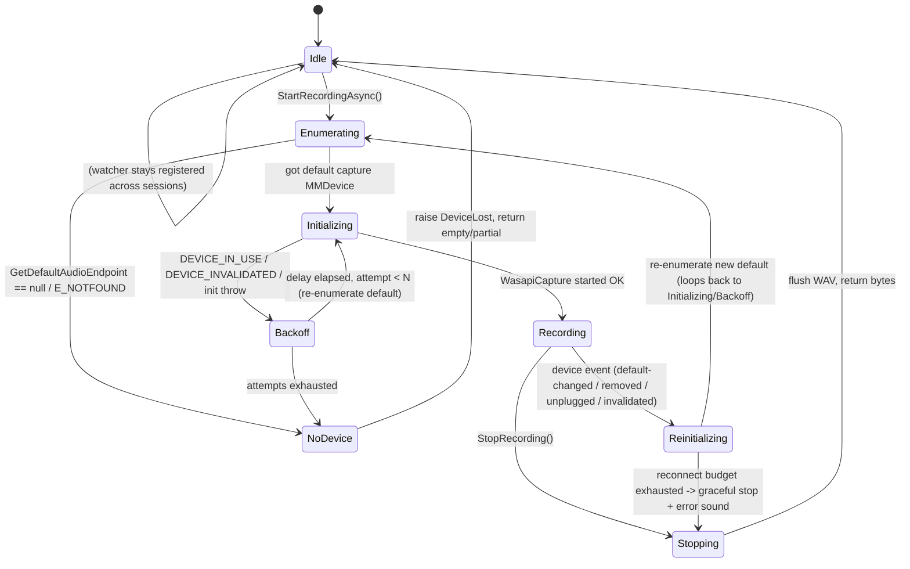

# Impl-02 — Mic Capture + Weekly-Driver-Update Resilience

**Requirement:** POA #3 — *Weekly driver-update resilience*. Capture microphone audio into
16 kHz mono PCM16 WAV bytes for STT, and **never hard-fail** when Windows pushes its weekly
audio/driver updates. Treat device-busy / device-invalidated / default-changed conditions as
**transient**, auto-reconnect to the new default capture endpoint, and only surface a user error
after retries are exhausted.

**Stack (decided):** WinUI 3 (Windows App SDK), .NET 8/9, C#. Capture via **NAudio** (managed
WASAPI/MMDevice wrapper). Backend: Groq `POST /audio/transcriptions` (multipart WAV).

**Status of the reference port:** `stha-hardik/freeflow-windows` (`audio_service.py`) captures at
16 kHz mono **float32** via `sounddevice`, scales `(audio * 32767).clip(...)` to int16, and writes
WAV with the `wave` module. It has **no runtime disconnect detection, no reconnect, no init retry**
(`available_devices()` is a one-shot helper only). *This document is where we improve on it.*

> All Windows-API claims below are verified against Microsoft Learn. URLs are cited inline and
> collected in [§11](#11-verified-reference-urls-microsoft-learn).

---

## 1. Purpose & pipeline fit

```
hotkey(down) ──▶ IAudioCaptureService.StartRecordingAsync()   [POA #3, this doc]
                       │  (mic → WASAPI shared-mode capture, 16 kHz mono PCM16)
hotkey(up)   ──▶ IAudioCaptureService.StopRecording() ─▶ byte[] wavBytes
                       │
                       ▼
             OpenAiCompatibleClient.TranscribeAsync(wavBytes)   [Kivi.Core, multipart]
                       ▼
                    Groq STT  ─▶  cleanup LLM  ─▶  paste
```

This service owns exactly one job: **produce a valid 16 kHz / mono / 16-bit PCM WAV `byte[]`**
for the STT multipart upload, and keep producing it across audio-device churn. It knows nothing
about hotkeys, HTTP, or the LLM — it sits behind `IAudioCaptureService` ([§6](#6-iaudiocaptureservice-interface--skeleton))
so the orchestrator and unit tests can drive it without a real mic.

Why 16 kHz mono PCM16 specifically: Whisper-family STT models (Groq `whisper-large-v3`) are
trained on 16 kHz mono; anything higher is downsampled server-side, so sending 16 kHz mono is the
smallest correct payload. 16-bit is the WAV bit depth we emit — see [§2](#2-naudio-setup) for why
this removes the float32→int16 conversion the Python port needs.

---

## 2. NAudio setup

### 2.1 NuGet

```xml
<!-- Kivi.Audio.csproj -->
<ItemGroup>
  <PackageReference Include="NAudio" Version="2.2.1" />
  <!-- NAudio 2.x is the .NET Standard 2.0 / .NET 8 line. It pulls in NAudio.Wasapi
       and NAudio.CoreAudioApi, which is where MMDeviceEnumerator / WasapiCapture live. -->
</ItemGroup>
```

`WasapiCapture`, `WaveInEvent`, `MMDeviceEnumerator`, `MMDevice`, `IMMNotificationClient`,
`DataFlow`, `DeviceState`, `Role` all live in `NAudio.CoreAudioApi` / `NAudio.Wave`.

### 2.2 WasapiCapture vs WaveInEvent — which and why

NAudio gives two capture front-ends. They are thin managed wrappers over two different Windows APIs:

| | `WasapiCapture` | `WaveInEvent` |
|---|---|---|
| Underlying API | **WASAPI** (`IAudioClient` / `IAudioCaptureClient`), Core Audio | legacy **waveIn** (MME) |
| Device identity | takes an `MMDevice` (endpoint) directly | integer device index into the MME list |
| Ties into MMDevice / `IMMNotificationClient` | **Yes** — same object model, same endpoint IDs | No — separate legacy enumeration |
| Native format | reports the endpoint's mix/shared format; you request yours | you request a `WaveFormat` |
| Error on device loss | surfaces `AUDCLNT_E_DEVICE_INVALIDATED` (recoverable per docs) | opaque MME error |
| Latency | lower | higher |

**Decision: use `WasapiCapture` (shared mode).** The entire resilience story is built on Core Audio
endpoint identity — `IMMNotificationClient` callbacks hand us **endpoint ID strings**, and
`MMDeviceEnumerator.GetDefaultAudioEndpoint(...)` hands us `MMDevice` objects. `WasapiCapture`
consumes exactly those objects, so "reconnect to the new default endpoint" is a direct, first-class
operation. `WaveInEvent`'s integer indices don't map cleanly onto endpoint-ID notifications, which
is precisely the seam we can't afford to be sloppy about here.

> Shared mode, not exclusive: a driver update or another app can hold the device; shared mode lets
> us coexist and is what `AUDCLNT_E_DEVICE_IN_USE` recovery assumes. (Exclusive mode is what
> *causes* `AUDCLNT_E_DEVICE_IN_USE` — avoid it.) See
> [IAudioClient::Initialize return codes](https://learn.microsoft.com/windows/win32/api/audioclient/nf-audioclient-iaudioclient-initialize#return-value).

`WasapiCapture` does not resample. In shared mode the audio engine will accept a `WaveFormat` you
set, but only formats the engine supports; 16 kHz/16-bit/mono PCM is universally supported in shared
mode, so we set it explicitly and read PCM16 bytes straight out.

### 2.3 Exact WaveFormat

```csharp
// 16 kHz, 16-bit, mono, PCM (LPCM) — the STT contract format.
public static readonly WaveFormat KiviWaveFormat = new WaveFormat(rate: 16000, bits: 16, channels: 1);
```

`new WaveFormat(16000, 16, 1)` constructs a standard PCM (`WaveFormatEncoding.Pcm`) format — this is
the important part for [§2.5](#25-no-float32int16-conversion-needed).

### 2.4 Writing captured buffers to a WAV MemoryStream

`WasapiCapture` raises `DataAvailable` on a capture thread with a `byte[]` already in the requested
PCM16 layout. We feed those bytes to a `WaveFileWriter` wrapping a `MemoryStream`. `WaveFileWriter`
writes the 44-byte RIFF/WAVE header and patches the length fields on `Dispose`/`Flush`, so on stop we
get a complete, uploadable WAV.

```csharp
private MemoryStream? _wavStream;
private WaveFileWriter? _writer;

// on start:
_wavStream = new MemoryStream();
_writer    = new WaveFileWriter(_wavStream, KiviWaveFormat); // header written here

// capture callback (runs on NAudio's capture thread):
private void OnDataAvailable(object? sender, WaveInEventArgs e)
{
    // e.Buffer is reused by NAudio; only e.BytesRecorded bytes are valid.
    _writer?.Write(e.Buffer, 0, e.BytesRecorded);   // append PCM16 frames
}

// on stop:
byte[] WavBytes()
{
    _writer!.Flush();                 // patch RIFF sizes so the header is valid
    byte[] bytes = _wavStream!.ToArray();
    _writer.Dispose();                // also disposes the underlying stream by default
    _writer = null; _wavStream = null;
    return bytes;
}
```

> Gotcha: `WaveFileWriter.Dispose()` disposes its underlying stream. Call `ToArray()` **before**
> `Dispose()`, as above. (Alternatively construct with a stream you own and flush without disposing.)

### 2.5 No float32→int16 conversion needed (why the Python step disappears)

The `sounddevice` port uses `DTYPE = "float32"`, so it must scale to int16:
`(audio * 32767).clip(-32768, 32767)`. That step exists **only because it chose a float32 stream.**

By constructing `WasapiCapture` with `WaveFormat(16000, 16, 1)` — a **PCM 16-bit** format — the
capture buffer NAudio hands us in `DataAvailable` is **already little-endian signed 16-bit PCM**.
`WaveFileWriter` initialized with the same `WaveFormat` writes those bytes verbatim. There is no
float sample path, so **no float32→int16 conversion and no clipping logic is required** — we skip an
entire numeric stage and its rounding bugs.

*(Caveat for completeness: `WasapiCapture` defaults to `WaveFormat.CreateIeeeFloatWaveFormat(...)`
if you don't set `WaveFormat`. We always set the PCM16 format explicitly in the constructor path
below, so the float path is never taken. If a specific driver refused 16 kHz shared-mode PCM — not
observed on mainstream hardware — the fallback is a float capture + `WaveFormatConversionStream` /
`MediaFoundationResampler` to PCM16; treat that as a last resort, not the norm.)*

---

## 3. IMMNotificationClient implementation

`IMMNotificationClient` is **implemented by the client** (us) and registered with the system via
`IMMDeviceEnumerator::RegisterEndpointNotificationCallback`; the OS then calls back on device events.
([interface ref](https://learn.microsoft.com/windows/win32/api/mmdeviceapi/nn-mmdeviceapi-immnotificationclient),
[register ref](https://learn.microsoft.com/windows/win32/api/mmdeviceapi/nf-mmdeviceapi-immdeviceenumerator-registerendpointnotificationcallback)).
NAudio exposes the same interface in managed form (`NAudio.CoreAudioApi.Interfaces.IMMNotificationClient`),
with the Win32 enums surfaced as `DataFlow`, `Role`, and `DeviceState`.

**Verified callback signatures** (all return `void` in NAudio's managed interface; Win32 returns
`HRESULT` — [Device Events](https://learn.microsoft.com/windows/win32/coreaudio/device-events)):

| Callback | Win32 params | Meaning |
|---|---|---|
| `OnDefaultDeviceChanged` | `EDataFlow flow, ERole role, LPCWSTR defaultDeviceId` | default endpoint for a role changed. **Fires once per role** (eConsole, eMultimedia, eCommunications) → up to 3 calls per user change. `defaultDeviceId` is **NULL** if no device can assume the role. |
| `OnDeviceAdded` | `LPCWSTR deviceId` | endpoint added |
| `OnDeviceRemoved` | `LPCWSTR deviceId` | endpoint removed |
| `OnDeviceStateChanged` | `LPCWSTR deviceId, DWORD newState` | state → one of `DEVICE_STATE_ACTIVE (0x1)`, `DISABLED (0x2)`, `NOTPRESENT (0x4)`, `UNPLUGGED (0x8)` |
| `OnPropertyValueChanged` | `LPCWSTR deviceId, PROPERTYKEY key` | a device property changed (we ignore) |

Confirmed enum values:
- `EDataFlow`: `eRender = 0, eCapture, eAll` → NAudio `DataFlow.Render / Capture / All`.
- `ERole`: `eConsole = 0, eMultimedia, eCommunications` → NAudio `Role.Console / Multimedia / Communications`.
- `DEVICE_STATE_XXX`: `ACTIVE=0x1, DISABLED=0x2, NOTPRESENT=0x4, UNPLUGGED=0x8`
  ([constants ref](https://learn.microsoft.com/windows/win32/coreaudio/device-state-xxx-constants)).

### 3.1 The three rules we MUST obey (verbatim from Microsoft Learn)

From the [IMMNotificationClient interface page](https://learn.microsoft.com/windows/win32/api/mmdeviceapi/nn-mmdeviceapi-immnotificationclient):

> 3. The methods of the interface must be nonblocking. The client should never wait on a
>    synchronization object during an event callback.
> 4. The client should never call `RegisterEndpointNotificationCallback` or
>    `UnregisterEndpointNotificationCallback` in its implementation of `IMMNotificationClient` methods.
> 5. The client should never release the final reference on an MMDevice API object during an event callback.

Consequence for our design: **the callback does nothing but drop a lightweight message into a queue
and return.** No `WasapiCapture` teardown, no `GetDefaultAudioEndpoint`, no register/unregister, no
`MMDevice` release inside the callback. All of that happens on a **worker thread** ([§5](#5-threading-rules)).

### 3.2 Concrete class

```csharp
using NAudio.CoreAudioApi;
using NAudio.CoreAudioApi.Interfaces;
using System.Threading.Channels;

/// <summary>What the callback observed. Deliberately tiny + immutable so the callback
/// allocates once and returns immediately (rule #3: non-blocking).</summary>
internal readonly record struct DeviceEvent(DeviceEventKind Kind, string? DeviceId, DeviceState State);

internal enum DeviceEventKind { DefaultChanged, Removed, StateChanged, Added }

/// <summary>
/// IMMNotificationClient implementation. It ONLY enqueues events. It never touches the
/// capture stream, never calls (Un)RegisterEndpointNotificationCallback, and never releases
/// an MMDevice — all forbidden inside callbacks. See rules 3/4/5.
/// </summary>
internal sealed class AudioEndpointWatcher : IMMNotificationClient
{
    private readonly ChannelWriter<DeviceEvent> _sink;

    public AudioEndpointWatcher(ChannelWriter<DeviceEvent> sink) => _sink = sink;

    // We only care about the CAPTURE default. Filtering here keeps the worker's job small;
    // OnDefaultDeviceChanged fires up to 3x (once per role) so we further dedupe downstream.
    public void OnDefaultDeviceChanged(DataFlow flow, Role role, string defaultDeviceId)
    {
        if (flow == DataFlow.Capture)
            _sink.TryWrite(new DeviceEvent(DeviceEventKind.DefaultChanged, defaultDeviceId, DeviceState.Active));
        // NB: defaultDeviceId may be null/empty when no device can assume the role — that is a
        //     valid "no mic" signal, handled by the worker, not here.
    }

    public void OnDeviceStateChanged(string deviceId, DeviceState newState)
        => _sink.TryWrite(new DeviceEvent(DeviceEventKind.StateChanged, deviceId, newState));

    public void OnDeviceRemoved(string deviceId)
        => _sink.TryWrite(new DeviceEvent(DeviceEventKind.Removed, deviceId, DeviceState.NotPresent));

    public void OnDeviceAdded(string deviceId)
        => _sink.TryWrite(new DeviceEvent(DeviceEventKind.Added, deviceId, DeviceState.Active));

    // Property churn is noise for us; ignore. (Must still be implemented.)
    public void OnPropertyValueChanged(string deviceId, PropertyKey key) { /* no-op */ }
}
```

`TryWrite` on an **unbounded** channel is non-blocking and lock-free — it satisfies rule #3. The
channel is drained by the worker in [§5](#5-threading-rules).

### 3.3 Registration / lifetime (done OUTSIDE any callback)

```csharp
private readonly MMDeviceEnumerator _enumerator = new();     // lives for the whole app
private AudioEndpointWatcher? _watcher;

private void RegisterWatcher(ChannelWriter<DeviceEvent> sink)
{
    _watcher = new AudioEndpointWatcher(sink);
    _enumerator.RegisterEndpointNotificationCallback(_watcher);  // OK: not inside a callback
}

private void UnregisterWatcher()
{
    if (_watcher is null) return;
    _enumerator.UnregisterEndpointNotificationCallback(_watcher); // OK: not inside a callback
    _watcher = null;
}
```

> Rule from [RegisterEndpointNotificationCallback remarks](https://learn.microsoft.com/windows/win32/api/mmdeviceapi/nf-mmdeviceapi-immdeviceenumerator-registerendpointnotificationcallback#remarks):
> the client is responsible for keeping the `IMMNotificationClient` object alive between Register and
> Unregister. We hold `_watcher` in a field for exactly that reason, and keep a single long-lived
> `MMDeviceEnumerator` (`_enumerator`) so we never release "the final reference" from event code.

---

## 4. Resilience state machine

We register the watcher **once for the app lifetime** so we can observe churn even between sessions.
At each session start we **re-enumerate** and bind capture to a *fresh* `MMDevice` (never a cached
handle) — this guarantees a driver swap between dictations cannot leave us pointing at a dead
endpoint.

### 4.1 States



Key transitions in words:

- **Idle → Enumerating → Initializing:** every `StartRecordingAsync` re-runs
  `GetDefaultAudioEndpoint(DataFlow.Capture, Role.Communications)` — *no cached device*.
  (`eCommunications`/`eConsole` are the correct roles for a stream-routing client per
  [Getting the Device Endpoint for Stream Routing](https://learn.microsoft.com/windows/win32/coreaudio/getting-the-default-device-endpoint-for-stream-routing) — *"Do not use eMultimedia"*.
  A dictation mic is a communications-style input, so we use `Role.Communications`.)
- **Initializing → Backoff → Initializing:** `AUDCLNT_E_DEVICE_IN_USE` / `AUDCLNT_E_DEVICE_INVALIDATED`
  right after a driver update is transient; back off and re-enumerate the default each attempt.
- **Recording → Reinitializing:** a device event during capture. Per
  [Recovering from an Invalid-Device Error](https://learn.microsoft.com/windows/win32/coreaudio/recovering-from-an-invalid-device-error):
  *release the client, call `GetDefaultAudioEndpoint`, re-activate on the new default.* We keep the
  accumulated WAV bytes and resume appending on the new endpoint (best-effort continuity).
- **Reinitializing → Stopping:** if we can't reconnect within the budget, stop gracefully, play the
  error cue, and hand back whatever audio we captured so far (may still be transcribable).

### 4.2 Backoff algorithm

Exponential, ~100→200→400ms, capped ~2s, with small jitter. Used by **init** and by **reconnect**.

```csharp
internal sealed class Backoff
{
    private readonly int _maxAttempts;
    private readonly TimeSpan _baseDelay;
    private readonly TimeSpan _capDelay;
    private readonly Random _rng = new();

    public Backoff(int maxAttempts = 6,
                   TimeSpan? baseDelay = null,
                   TimeSpan? capDelay = null)
    {
        _maxAttempts = maxAttempts;
        _baseDelay   = baseDelay ?? TimeSpan.FromMilliseconds(100);
        _capDelay    = capDelay  ?? TimeSpan.FromSeconds(2);
    }

    /// <summary>Delay before attempt N (1-based). 100,200,400,800,1600,2000(cap)... + jitter.</summary>
    public TimeSpan DelayFor(int attempt)
    {
        double ms = _baseDelay.TotalMilliseconds * Math.Pow(2, attempt - 1);
        ms = Math.Min(ms, _capDelay.TotalMilliseconds);
        ms += _rng.Next(0, 50);                 // jitter, avoids lockstep with the OS re-enum
        return TimeSpan.FromMilliseconds(ms);
    }

    /// <summary>
    /// Run <paramref name="attempt"/> with retry on transient audio failures.
    /// Returns true on success; false when attempts are exhausted.
    /// </summary>
    public async Task<bool> RunAsync(Func<Task> attempt,
                                     Func<Exception, bool> isTransient,
                                     CancellationToken ct)
    {
        for (int n = 1; n <= _maxAttempts; n++)
        {
            ct.ThrowIfCancellationRequested();
            try
            {
                await attempt().ConfigureAwait(false);
                return true;
            }
            catch (Exception ex) when (isTransient(ex) && n < _maxAttempts)
            {
                await Task.Delay(DelayFor(n), ct).ConfigureAwait(false);
            }
        }
        return false;
    }
}
```

Transient classifier (maps NAudio's `COMException`/`HRESULT` onto the recoverable Core Audio codes):

```csharp
// From audioclient.h — verified error codes.
private const int AUDCLNT_E_DEVICE_INVALIDATED = unchecked((int)0x88890004);
private const int AUDCLNT_E_DEVICE_IN_USE      = unchecked((int)0x8889000A);
private const int AUDCLNT_E_RESOURCES_INVALIDATED = unchecked((int)0x88890026);

private static bool IsTransientAudio(Exception ex) => ex switch
{
    // NAudio surfaces WASAPI HRESULTs as COMException; also treat "no device yet" as transient
    // because a driver update can momentarily present zero capture endpoints.
    System.Runtime.InteropServices.COMException ce =>
        ce.HResult is AUDCLNT_E_DEVICE_INVALIDATED
                   or AUDCLNT_E_DEVICE_IN_USE
                   or AUDCLNT_E_RESOURCES_INVALIDATED,
    InvalidOperationException => true,   // NAudio "no device" / not-active-state races
    _ => false,
};
```

---

## 5. Threading rules — how we obey them concretely

The whole point: **callbacks enqueue, a worker acts.** One unbounded `Channel<DeviceEvent>` bridges
the two. The worker is a single long-running background `Task`, so all capture (re)init is serialized
onto one thread — no locks held during callbacks, no reentrancy into register/unregister, no
`MMDevice` release from callback context.

```csharp
private readonly Channel<DeviceEvent> _events =
    Channel.CreateUnbounded<DeviceEvent>(new UnboundedChannelOptions
    {
        SingleReader = true,      // one worker drains it
        SingleWriter = false,     // OS may fire callbacks concurrently
    });

private Task? _worker;
private CancellationTokenSource? _cts;

private void StartWorker()
{
    _cts = new CancellationTokenSource();
    _worker = Task.Run(() => WorkerLoopAsync(_cts.Token));
}

private async Task WorkerLoopAsync(CancellationToken ct)
{
    string? currentEndpointId = _currentDevice?.ID;

    await foreach (DeviceEvent ev in _events.Reader.ReadAllAsync(ct))
    {
        // Dedupe the OnDefaultDeviceChanged storm (fires per-role). Only react when the
        // capture default actually differs from what we're bound to.
        bool affectsUs = ev.Kind switch
        {
            DeviceEventKind.DefaultChanged => !string.Equals(ev.DeviceId, currentEndpointId, StringComparison.Ordinal),
            DeviceEventKind.Removed        => string.Equals(ev.DeviceId, currentEndpointId, StringComparison.Ordinal),
            DeviceEventKind.StateChanged   => string.Equals(ev.DeviceId, currentEndpointId, StringComparison.Ordinal)
                                              && ev.State is DeviceState.Unplugged or DeviceState.NotPresent or DeviceState.Disabled,
            _ => false,   // Added: handled implicitly by re-enumerating the default when needed
        };

        if (!affectsUs) continue;
        if (State != RecordingState.Recording) continue; // only rebind while actually recording

        // ALL the "forbidden in callbacks" work happens HERE, on the worker:
        //   tear down capture, GetDefaultAudioEndpoint, re-activate, release old MMDevice.
        bool ok = await ReconnectToNewDefaultAsync(ct).ConfigureAwait(false);
        currentEndpointId = _currentDevice?.ID;

        if (!ok)
        {
            RaiseDeviceLost("Could not reconnect to a microphone after device change.");
            StopRecordingInternal(playErrorSound: true);
        }
        else
        {
            RaiseReconnected(currentEndpointId);
        }
    }
}
```

`ReconnectToNewDefaultAsync` is the only place that mutates capture state, and it uses the
[§4.2](#42-backoff-algorithm) backoff:

```csharp
private async Task<bool> ReconnectToNewDefaultAsync(CancellationToken ct)
{
    // 1. Stop + dispose the old capture (release WASAPI interfaces first — Recovering-from-Invalid-Device).
    TeardownCapture();                 // capture.StopRecording(); capture.Dispose(); capture=null;
    ReleaseCurrentDevice();            // _currentDevice?.Dispose(); _currentDevice=null; (worker thread, safe)

    // 2/3. Re-enumerate the *new* default and re-activate, with transient retry.
    var backoff = new Backoff(maxAttempts: 6);
    return await backoff.RunAsync(
        attempt: () =>
        {
            _currentDevice = _enumerator.GetDefaultAudioEndpoint(DataFlow.Capture, Role.Communications)
                             ?? throw new InvalidOperationException("No default capture endpoint.");
            OpenCaptureOn(_currentDevice);   // new WasapiCapture(device){WaveFormat=KiviWaveFormat}; wire DataAvailable; StartRecording();
            return Task.CompletedTask;
        },
        isTransient: IsTransientAudio,
        ct: ct);
}
```

Because the worker is the *single reader* and the sole mutator of capture state, the NAudio capture
thread (`DataAvailable`) and the OS callback thread never race on it — the capture thread only ever
appends bytes to the `WaveFileWriter`, and during teardown we stop the capture before disposing the
writer.

---

## 6. IAudioCaptureService interface + skeleton

```csharp
public enum RecordingState { Idle, Starting, Recording, Reconnecting, Stopping }

public sealed class DeviceLostEventArgs : EventArgs
{
    public required string Reason { get; init; }
    public bool Recovered { get; init; }
}

public sealed class DeviceReconnectedEventArgs : EventArgs
{
    public string? NewEndpointId { get; init; }
    public string? NewFriendlyName { get; init; }
}

public interface IAudioCaptureService : IAsyncDisposable
{
    RecordingState State { get; }

    /// <summary>Re-enumerates the default capture endpoint and starts capture, with init
    /// retry/backoff. Throws AudioCaptureException only after retries are exhausted
    /// (mic-not-found / permanently busy). Idempotent-safe: no-op if already Recording.</summary>
    Task StartRecordingAsync(CancellationToken ct = default);

    /// <summary>Stops capture, flushes, and returns a complete 16 kHz mono PCM16 WAV.
    /// Returns an empty array if nothing was captured. Never throws for device loss —
    /// returns whatever audio was captured before the loss.</summary>
    byte[] StopRecording();

    /// <summary>Raised when the active mic is lost. Recovered=true if we auto-reconnected;
    /// Recovered=false means capture was stopped and the caller should surface an error + cue.</summary>
    event EventHandler<DeviceLostEventArgs>? DeviceLost;

    /// <summary>Raised after a successful transparent reconnect to a new default endpoint.</summary>
    event EventHandler<DeviceReconnectedEventArgs>? DeviceReconnected;
}
```

Concrete skeleton (fields + the public entry points; internals shown in §3–§5):

```csharp
public sealed class WasapiAudioCaptureService : IAudioCaptureService
{
    private readonly MMDeviceEnumerator _enumerator = new();
    private readonly Channel<DeviceEvent> _events = Channel.CreateUnbounded<DeviceEvent>(
        new UnboundedChannelOptions { SingleReader = true, SingleWriter = false });

    private AudioEndpointWatcher? _watcher;
    private WasapiCapture? _capture;
    private MMDevice? _currentDevice;
    private MemoryStream? _wavStream;
    private WaveFileWriter? _writer;
    private Task? _worker;
    private CancellationTokenSource? _cts;
    private readonly object _flushGate = new();      // serialize StopRecording vs teardown

    public static readonly WaveFormat KiviWaveFormat = new(16000, 16, 1);
    public RecordingState State { get; private set; } = RecordingState.Idle;

    public event EventHandler<DeviceLostEventArgs>? DeviceLost;
    public event EventHandler<DeviceReconnectedEventArgs>? DeviceReconnected;

    public WasapiAudioCaptureService()
    {
        RegisterWatcher(_events.Writer);   // registered ONCE, lives across sessions (§3.3)
        StartWorker();                     // long-running drain loop (§5)
    }

    public async Task StartRecordingAsync(CancellationToken ct = default)
    {
        if (State is RecordingState.Recording or RecordingState.Starting) return;
        State = RecordingState.Starting;

        _wavStream = new MemoryStream();
        _writer    = new WaveFileWriter(_wavStream, KiviWaveFormat);

        var backoff = new Backoff(maxAttempts: 6);          // 100→200→400→800→1600→2000ms
        bool ok = await backoff.RunAsync(
            attempt: () =>
            {
                // ALWAYS re-enumerate — never cache a device across sessions (POA #3).
                _currentDevice = _enumerator.GetDefaultAudioEndpoint(DataFlow.Capture, Role.Communications)
                                 ?? throw new InvalidOperationException("No default capture endpoint.");
                OpenCaptureOn(_currentDevice);
                return Task.CompletedTask;
            },
            isTransient: IsTransientAudio, ct: ct).ConfigureAwait(false);

        if (!ok)
        {
            State = RecordingState.Idle;
            _writer?.Dispose(); _writer = null; _wavStream = null;
            throw new AudioCaptureException("No usable microphone (device busy or not found after retries).");
        }
        State = RecordingState.Recording;
    }

    public byte[] StopRecording()
    {
        lock (_flushGate)
        {
            if (State is RecordingState.Idle) return Array.Empty<byte>();
            State = RecordingState.Stopping;
            TeardownCapture();
            if (_writer is null || _wavStream is null) { State = RecordingState.Idle; return Array.Empty<byte>(); }

            _writer.Flush();
            byte[] bytes = _wavStream.ToArray();   // BEFORE Dispose (§2.4 gotcha)
            _writer.Dispose(); _writer = null; _wavStream = null;
            ReleaseCurrentDevice();
            State = RecordingState.Idle;
            return bytes;
        }
    }

    private void OpenCaptureOn(MMDevice device)
    {
        _capture = new WasapiCapture(device) { WaveFormat = KiviWaveFormat };
        _capture.DataAvailable += OnDataAvailable;
        _capture.RecordingStopped += OnRecordingStopped;   // observe unexpected stops
        _capture.StartRecording();
    }

    private void OnDataAvailable(object? sender, WaveInEventArgs e)
    {
        lock (_flushGate) { _writer?.Write(e.Buffer, 0, e.BytesRecorded); }
    }

    private void OnRecordingStopped(object? sender, StoppedEventArgs e)
    {
        // If NAudio stopped us with an exception mid-recording, treat as a device event so the
        // worker attempts reconnect (belt-and-suspenders alongside IMMNotificationClient).
        if (e.Exception is not null && State == RecordingState.Recording)
            _events.Writer.TryWrite(new DeviceEvent(DeviceEventKind.StateChanged, _currentDevice?.ID, DeviceState.NotPresent));
    }

    public async ValueTask DisposeAsync()
    {
        UnregisterWatcher();               // outside any callback (§3.3)
        _cts?.Cancel();
        _events.Writer.TryComplete();
        if (_worker is not null) { try { await _worker; } catch (OperationCanceledException) { } }
        TeardownCapture(); ReleaseCurrentDevice();
        _writer?.Dispose(); _enumerator.Dispose();
    }

    // RegisterWatcher / UnregisterWatcher / StartWorker / WorkerLoopAsync /
    // ReconnectToNewDefaultAsync / TeardownCapture / ReleaseCurrentDevice / RaiseDeviceLost /
    // RaiseReconnected / IsTransientAudio  — see §3.3, §4, §5.
}
```

---

## 7. Error handling & user-facing behavior

Default timeouts/budgets (all configurable):

| Setting | Default | Rationale |
|---|---|---|
| Init backoff | 6 attempts, 100ms→cap 2s (~5.1s total worst case) | driver-update busy window is seconds, not minutes |
| Reconnect backoff | 6 attempts, same curve | same transient window mid-recording |
| Max single dictation | **~20s** hard cap (configurable) | matches the pipeline's ~20s STT/paste timeouts; prevents runaway buffers |
| `DataAvailable` buffer | ~100 ms (`BufferMilliseconds`-equivalent) | small chunks → responsive teardown |

| Scenario | Detection | Behavior |
|---|---|---|
| **Mic not found at start** | `GetDefaultAudioEndpoint` → `null` / `E_NOTFOUND` on every attempt | after 6 attempts, throw `AudioCaptureException`; UI shows "No microphone detected", no crash |
| **Device busy after driver update** | init throws `AUDCLNT_E_DEVICE_IN_USE`/`_INVALIDATED` | backoff retries; usually succeeds within 1–2 tries; transparent to user |
| **Default device changed mid-recording** | `OnDefaultDeviceChanged(Capture,…)` | worker rebinds to new default, keeps WAV buffer, raises `DeviceReconnected`; recording continues |
| **Active mic unplugged/removed mid-recording** | `OnDeviceRemoved` / `OnDeviceStateChanged`(UNPLUGGED/NOTPRESENT) for current endpoint | worker attempts reconnect to new default; if another mic exists → continue; else graceful stop + **error sound**, return partial WAV, raise `DeviceLost(Recovered=false)` |
| **No device can assume the role** | `OnDefaultDeviceChanged` with `defaultDeviceId == null` | treat as removed; reconnect attempts fail → graceful stop + error cue |
| **NAudio `RecordingStopped` with exception** | `OnRecordingStopped(e.Exception != null)` | belt-and-suspenders: enqueue a synthetic device event → worker reconnect path |

Principle: **the only user-visible failure is "no mic after retries".** Everything short of that is
either silent (reconnect) or a soft "recording ended early" + error sound with a partial transcript
attempt.

---

## 8. Performance notes (toward <100 MB RSS)

- **Idle = zero capture.** No `WasapiCapture` object exists while idle; the only always-on cost is
  the single `MMDeviceEnumerator` + registered watcher (a few KB) and one parked worker `Task`.
  No audio threads run between dictations → idle CPU ≈ 0, the POA #5 requirement.
- **Streaming append, not naive whole-utterance float buffering.** We write PCM16 straight into the
  `WaveFileWriter`/`MemoryStream` as `DataAvailable` fires; we never hold a `List<float[]>` of the
  whole utterance the way the float32 Python port does. PCM16 also halves the byte footprint vs
  float32 (2 bytes/sample vs 4).
- **The honest tradeoff:** Groq `/audio/transcriptions` is a **multipart upload that needs the full
  WAV bytes** — there is no chunked/streaming STT in this contract. So we *do* hold the complete
  utterance in the `MemoryStream` at stop time. That's bounded and cheap: 16 kHz × 2 bytes × 1 ch =
  **32 KB/s** → a 20 s cap is **~640 KB** + 44-byte header. Negligible against 100 MB. We do **not**
  additionally copy it into a `List<byte>` and then a WAV — the `MemoryStream` *is* the buffer, and
  `ToArray()` produces the one copy the HTTP multipart body needs.
- **Buffer reuse:** NAudio reuses `e.Buffer`; we copy only the valid `e.BytesRecorded` slice into the
  writer, no per-chunk allocation beyond the writer's internal stream growth. Pre-size the
  `MemoryStream` to `~32KB * expectedSeconds` to avoid reallocation churn.
- **Dispose discipline:** every `WasapiCapture` and `MMDevice` is disposed on teardown/reconnect;
  leaking them leaks COM handles and shows up as slow RSS creep across many dictations.

---

## 9. Testing without special hardware

**Manual device-change simulation (no second mic required):**

1. **Disable/enable the mic:** Settings → System → Sound → Input → device → *Don't allow* / *Allow*;
   or `Win+R` → `control mmsys.cpl,,1` (opens the Recording tab) → right-click device → Disable /
   Enable. Disable fires `OnDeviceStateChanged(DISABLED)`; enabling flips it back. This is the
   cheapest reproduction of the weekly-driver "device vanished/reappeared" case.
2. **Change the default:** with two inputs (e.g. built-in mic + any USB headset, or a virtual audio
   cable like VB-CABLE), set a different default in the Recording tab mid-recording →
   `OnDefaultDeviceChanged(Capture,…)`.
3. **Unplug a USB mic** mid-recording → `OnDeviceRemoved` + `OnDeviceStateChanged(UNPLUGGED/NOTPRESENT)`.
4. **Simulate "busy after update":** open the device in another app in exclusive mode, or start a
   Teams/Zoom call, then start dictation → exercises `AUDCLNT_E_DEVICE_IN_USE` → backoff.
5. **Virtual devices** (VB-CABLE / VoiceMeeter) can be installed/removed on CI-adjacent dev boxes to
   generate add/remove events deterministically.

**Unit-testing the state machine with a fake enumerator (no device at all):**

Abstract the two Windows touch-points behind seams so the whole [§4](#4-resilience-state-machine)
FSM is testable in-memory:

```csharp
internal interface IEndpointProvider           // wraps MMDeviceEnumerator
{
    IAudioEndpoint? GetDefaultCapture();        // null = E_NOTFOUND
    void Register(IMMNotificationClient c);
    void Unregister(IMMNotificationClient c);
}

internal interface ICaptureFactory              // wraps `new WasapiCapture(device)`
{
    ICaptureSession Open(IAudioEndpoint device, WaveFormat fmt); // may throw IsTransientAudio-classified ex
}
```

A `FakeEndpointProvider` can:
- return `null` N times then a device → asserts init backoff succeeds on retry;
- return a device whose `Open` throws `COMException(AUDCLNT_E_DEVICE_IN_USE)` twice then succeeds →
  asserts backoff delays + eventual `Recording`;
- push a `DeviceEvent(DefaultChanged, "new-id")` into the channel and flip the "default" it returns →
  asserts the worker rebinds and raises `DeviceReconnected`;
- push `Removed` for the current id with no replacement → asserts graceful stop + `DeviceLost(false)`.

Assert on: emitted events, final `RecordingState`, number of `Open` attempts, and total simulated
delay (inject a fake clock/`Task.Delay` to keep tests fast). No mic, no COM, fully deterministic —
mirrors the "unit-testable end to end" goal from the reuse plan.

---

## 10. Failure modes table

| # | Failure mode | Trigger | Detection | Recovery | User impact |
|---|---|---|---|---|---|
| F1 | No default capture endpoint at start | fresh boot / all mics disabled / mid-update gap | `GetDefaultAudioEndpoint`→null (`E_NOTFOUND`) each attempt | init backoff ×6, then fail | error toast "No microphone detected"; no crash |
| F2 | Device busy at start | exclusive-mode app / driver mid-init | `AUDCLNT_E_DEVICE_IN_USE` on `Open` | backoff, re-enumerate each try | usually invisible; else F1-style error |
| F3 | Default changed mid-recording | user/OS switches default input | `OnDefaultDeviceChanged(Capture)` | worker rebinds, keep buffer | seamless; `DeviceReconnected` fires |
| F4 | Active mic unplugged | USB pull / jack removal | `OnDeviceRemoved` / `StateChanged(UNPLUGGED)` | reconnect to new default; else graceful stop | continues if another mic; else early stop + error sound |
| F5 | Device invalidated mid-stream | driver reset/update while streaming | `AUDCLNT_E_DEVICE_INVALIDATED` (via `RecordingStopped`/next call) | teardown → GetDefaultAudioEndpoint → reactivate (per MS recovery steps) | brief gap, then continues |
| F6 | No device can assume role | last mic removed | `OnDefaultDeviceChanged` id == null | reconnect fails → graceful stop | early stop + error sound, partial transcript attempt |
| F7 | Callback storm | `OnDefaultDeviceChanged` fires ×3 (per role) | dedupe by endpoint-id in worker | act once | none |
| F8 | Runaway recording | hotkey stuck / user holds too long | ~20 s hard cap | auto-stop, flush WAV | dictation ends at cap; bounded RAM |
| F9 | COM/handle leak | missing dispose on reconnect | RSS creep across sessions | strict Dispose in teardown/reconnect/DisposeAsync | none if disciplined |
| F10 | Zero bytes captured | started + stopped instantly / silent | `_wavStream.Length <= header` | return empty `byte[]`; skip STT call | "didn't catch that", no bad upload |

---

## 11. Verified reference URLs (Microsoft Learn)

Core Audio / MMDevice / notifications:
- IMMNotificationClient (interface + 3 rules): https://learn.microsoft.com/windows/win32/api/mmdeviceapi/nn-mmdeviceapi-immnotificationclient
- OnDefaultDeviceChanged (signature; NULL id; per-role firing): https://learn.microsoft.com/windows/win32/api/mmdeviceapi/nf-mmdeviceapi-immnotificationclient-ondefaultdevicechanged
- OnDeviceStateChanged (signature; DEVICE_STATE values): https://learn.microsoft.com/windows/win32/api/mmdeviceapi/nf-mmdeviceapi-immnotificationclient-ondevicestatechanged
- RegisterEndpointNotificationCallback (+ lifetime/refcount remarks): https://learn.microsoft.com/windows/win32/api/mmdeviceapi/nf-mmdeviceapi-immdeviceenumerator-registerendpointnotificationcallback
- UnregisterEndpointNotificationCallback: https://learn.microsoft.com/windows/win32/api/mmdeviceapi/nf-mmdeviceapi-immdeviceenumerator-unregisterendpointnotificationcallback
- Device Events (full IMMNotificationClient code example): https://learn.microsoft.com/windows/win32/coreaudio/device-events
- DEVICE_STATE_XXX Constants (ACTIVE/DISABLED/NOTPRESENT/UNPLUGGED values): https://learn.microsoft.com/windows/win32/coreaudio/device-state-xxx-constants
- EDataFlow enumeration (eRender/eCapture/eAll): https://learn.microsoft.com/windows/win32/api/mmdeviceapi/ne-mmdeviceapi-edataflow
- ERole enumeration (eConsole/eMultimedia/eCommunications): https://learn.microsoft.com/windows/win32/api/mmdeviceapi/ne-mmdeviceapi-erole
- GetDefaultAudioEndpoint: https://learn.microsoft.com/windows/win32/api/mmdeviceapi/nf-mmdeviceapi-immdeviceenumerator-getdefaultaudioendpoint

WASAPI stream routing / recovery:
- Stream Routing (overview): https://learn.microsoft.com/windows/win32/coreaudio/stream-routing
- Relevant Notifications for Stream Routing: https://learn.microsoft.com/windows/win32/coreaudio/relevant-device-notifications-for-stream-routing
- Getting the Device Endpoint for Stream Routing ("Do not use eMultimedia"): https://learn.microsoft.com/windows/win32/coreaudio/getting-the-default-device-endpoint-for-stream-routing
- Stream Routing Implementation Considerations: https://learn.microsoft.com/windows/win32/coreaudio/stream-routing-implementation-considerations
- Recovering from an Invalid-Device Error (release → GetDefaultAudioEndpoint → reactivate): https://learn.microsoft.com/windows/win32/coreaudio/recovering-from-an-invalid-device-error
- IAudioClient::Initialize (AUDCLNT_E_DEVICE_INVALIDATED / DEVICE_IN_USE / RESOURCES_INVALIDATED): https://learn.microsoft.com/windows/win32/api/audioclient/nf-audioclient-iaudioclient-initialize

NAudio / capture mapping:
- NAudio `MMDeviceEnumerator.EnumerateAudioEndPoints(DataFlow.Capture, DeviceState.Active)` sample: https://learn.microsoft.com/azure/ai-services/speech-service/how-to-select-audio-input-devices#audio-device-ids-on-windows-for-desktop-applications
- NAudio `WaveInEvent`/`WaveFormat(16000,16,1)` + Channel backpressure sample: https://learn.microsoft.com/azure/foundry-local/how-to/how-to-live-transcribe-audio?pivots=programming-language-csharp#live-transcribe-from-microphone
```

Reference (not MS docs): `stha-hardik/freeflow-windows` `src/freeflow/audio_service.py` — the
float32 `sounddevice` capture with **no** device-change handling that this design supersedes.
