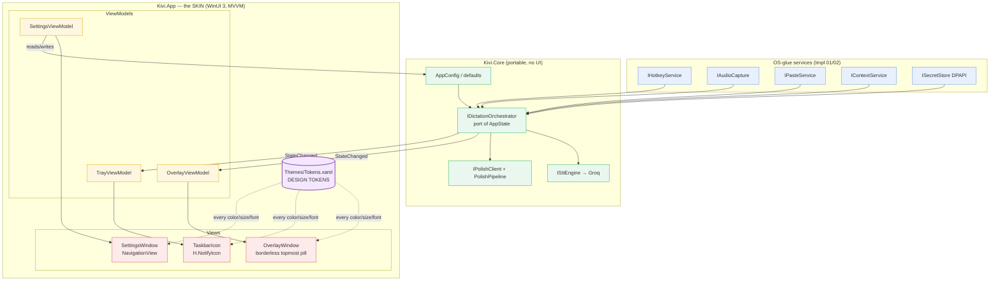

# Impl 03 — WinUI 3 "Kivi UI" Presentation Layer

> **Scope.** This document specifies the *polished WinUI 3 UI skin* that sits on top of the
> ported FreeFlow engine (`Kivi.Core` + OS-glue services). It covers the recording overlay
> pill, system tray, settings window, theming, deployment, performance, and — critically —
> the **token-swap workflow** for when the real Kivi visual design arrives.
>
> **Framing (from `overview.md`):** *FreeFlow engine = core, Kivi UI = skin.* The engineering
> goal of this layer is that applying the real Kivi design later is **mostly editing one
> `ResourceDictionary` of design tokens plus a handful of control templates — not rewriting
> views**. Everything below is built to make that true.
>
> **Prereqs read:** `docs/freeflow-research.md`, `docs/overview.md`.
> **Decisions honored:** WinUI 3 / Windows App SDK, .NET 8/9, C#, XAML + MVVM. Tray via
> **H.NotifyIcon**. Overlay = borderless topmost `AppWindow` + `OverlappedPresenter`,
> click-through via `WS_EX_TRANSPARENT | WS_EX_LAYERED`. Deployment: **unpackaged + Windows
> App SDK bootstrapper** (recommended). Budget: **<100 MB RSS**. Light/dark theme.

All API claims below were verified against Microsoft Learn; cited URLs are collected in
[§11 References](#11-references-verified).

---

## Table of contents

1. [Architecture — UI layer over the engine (MVVM)](#1-architecture--ui-layer-over-the-engine-mvvm)
2. [The "skin = tokens" strategy](#2-the-skin--tokens-strategy)
3. [Recording overlay pill](#3-recording-overlay-pill)
4. [System tray (H.NotifyIcon)](#4-system-tray-hnotifyicon)
5. [Settings window](#5-settings-window)
6. [Theming (light/dark)](#6-theming-lightdark)
7. [Deployment](#7-deployment)
8. [Performance (<100 MB RSS)](#8-performance-100-mb-rss)
9. [The "when the Kivi design link arrives" workflow](#9-the-when-the-kivi-design-link-arrives-workflow)
10. [Project structure](#10-project-structure)
11. [References (verified)](#11-references-verified)

---

## 1. Architecture — UI layer over the engine (MVVM)

The UI **never touches the pipeline directly**. It observes an orchestrator's state and sends
commands to it. This is the seam that keeps "skin" decoupled from "engine".

### 1.1 The pipeline state contract

The engine (built in the previous impl docs) exposes exactly two things to the UI:

- a **`RecordingState`** it publishes as it moves through the pipeline, and
- a set of **commands** the UI can invoke.

```csharp
// Kivi.Core/Orchestration/RecordingState.cs
public enum RecordingState
{
    Idle,          // hotkey armed, mic closed, ~0 CPU
    Listening,     // hold-to-talk active, capturing PCM16
    Transcribing,  // STT + context + cleanup in flight (Groq)
    Pasting,       // modifier-release wait + SendInput Ctrl+V
    Error          // transient failure surfaced to user
}

// Kivi.Core/Orchestration/IDictationOrchestrator.cs
public interface IDictationOrchestrator
{
    RecordingState State { get; }
    event EventHandler<RecordingStateChangedEventArgs> StateChanged; // raised on any transition
    string? LastResult { get; }          // last pasted text (for "copy again")
    string? LastError { get; }

    Task StartAsync();                    // manual start (tray "Start dictation")
    Task StopAsync();                     // manual stop
    Task CopyLastResultAgainAsync();      // re-copy last text to clipboard
}
```

> The orchestrator is the C# port of FreeFlow's `AppState` (see `freeflow-research.md` §Step 3).
> The UI treats it as an opaque source of `RecordingState` + `LastResult`/`LastError`.

### 1.2 MVVM shape

- **Models / services:** `Kivi.Core` (HTTP client, prompts, PolishPipeline) + OS-glue services
  (hotkey, audio, paste, context, secret store). No XAML types.
- **ViewModels:** `ObservableObject`s (CommunityToolkit.Mvvm) that subscribe to
  `IDictationOrchestrator.StateChanged` and re-project state into bindable properties. They
  hold `RelayCommand`s that call orchestrator methods. **ViewModels never reference `Window`,
  `AppWindow`, or any `Microsoft.UI.Xaml` control type** — this keeps them unit-testable and
  makes the views pure skin.
- **Views:** XAML that binds (`x:Bind`, compiled) to VMs and consumes only *design tokens* from
  `Themes/Tokens.xaml` for every color, brush, size, radius, and font.

Marshalling: `StateChanged` fires on a background thread. Each view-model marshals onto the UI
thread with the window's `DispatcherQueue` before mutating bindable state.

```csharp
// Kivi.App/ViewModels/OverlayViewModel.cs
using CommunityToolkit.Mvvm.ComponentModel;
using Microsoft.UI.Dispatching;

public partial class OverlayViewModel : ObservableObject
{
    private readonly IDictationOrchestrator _orch;
    private readonly DispatcherQueue _ui;

    public OverlayViewModel(IDictationOrchestrator orch, DispatcherQueue ui)
    {
        _orch = orch;
        _ui = ui;
        _orch.StateChanged += OnStateChanged;
        Apply(_orch.State);
    }

    [ObservableProperty] private bool _isVisible;
    [ObservableProperty] private string _statusText = "";
    [ObservableProperty] private RecordingState _state;

    // Derived flags the XAML VisualStateManager / converters bind to:
    public bool IsListening   => State == RecordingState.Listening;
    public bool IsProcessing  => State is RecordingState.Transcribing or RecordingState.Pasting;
    public bool IsError       => State == RecordingState.Error;

    private void OnStateChanged(object? s, RecordingStateChangedEventArgs e)
        => _ui.TryEnqueue(() => Apply(e.NewState));

    private void Apply(RecordingState state)
    {
        State = state;
        OnPropertyChanged(nameof(IsListening));
        OnPropertyChanged(nameof(IsProcessing));
        OnPropertyChanged(nameof(IsError));
        (StatusText, IsVisible) = state switch
        {
            RecordingState.Idle         => ("", false),
            RecordingState.Listening    => ("Listening…", true),
            RecordingState.Transcribing => ("Transcribing…", true),
            RecordingState.Pasting      => ("Pasting…", true),
            RecordingState.Error        => (_orch.LastError ?? "Something went wrong", true),
            _                           => ("", false)
        };
    }
}
```

### 1.3 Component diagram



The dotted arrows are the whole point: **`Tokens.xaml` feeds every view.** Swap it, reskin the app.

---

## 2. The "skin = tokens" strategy

### 2.1 Principle

Views reference **semantic token keys**, never literal values. There are two layers:

1. **Primitive tokens** — the raw palette/ramp/scale (e.g. `KiviBrand500`, `KiviSpace16`).
   These are the values that come *straight from the design system*.
2. **Semantic tokens** — role-based aliases the views actually bind to
   (e.g. `KiviAccentBrush`, `OverlayPillBackgroundBrush`, `OverlayCornerRadius`). These map a
   *role* to a primitive, and are the theme-aware layer.

Views only ever reference **semantic** tokens. When the design arrives, you re-point semantic
tokens at new primitives (and add/adjust primitives). Views stay untouched.

> **Why `ThemeResource` and not `StaticResource` in views:** `ThemeResource` re-evaluates on
> theme change at runtime; `StaticResource` is resolved once at load. Semantic brushes are
> theme-dependent, so views bind them with `{ThemeResource …}`. Inside a `ThemeDictionaries`
> entry, however, you must use `{StaticResource …}` (Microsoft's explicit guideline — using
> `ThemeResource` inside theme dictionaries causes cross-subtree bleed bugs). Verified:
> [XAML theme resources — guidelines].

### 2.2 Representative token dictionary — `Themes/Tokens.xaml`

This is the **placeholder token set** (clean, neutral, Fluent-ish). Everything the real Kivi
design touches lives here.

```xml
<!-- Kivi.App/Themes/Tokens.xaml -->
<ResourceDictionary
    xmlns="http://schemas.microsoft.com/winfx/2006/xaml/presentation"
    xmlns:x="http://schemas.microsoft.com/winfx/2006/xaml">

    <!-- ============================================================= -->
    <!-- LAYER 1 — PRIMITIVE TOKENS (theme-agnostic raw values)        -->
    <!-- These are the values a design system hands you directly.      -->
    <!-- ============================================================= -->

    <!-- Brand ramp (PLACEHOLDER — Sarvam teal-ish neutral) -->
    <Color x:Key="KiviBrand100">#D6F2EE</Color>
    <Color x:Key="KiviBrand300">#66C7BC</Color>
    <Color x:Key="KiviBrand500">#0FA697</Color>
    <Color x:Key="KiviBrand700">#0A7A6F</Color>

    <!-- Neutral ramp -->
    <Color x:Key="KiviNeutral0">#FFFFFF</Color>
    <Color x:Key="KiviNeutral50">#F5F6F7</Color>
    <Color x:Key="KiviNeutral200">#D9DCE1</Color>
    <Color x:Key="KiviNeutral600">#5B6270</Color>
    <Color x:Key="KiviNeutral900">#14161A</Color>

    <!-- Signal colors -->
    <Color x:Key="KiviDanger500">#E5484D</Color>
    <Color x:Key="KiviWarn500">#E0A800</Color>

    <!-- Type scale -->
    <x:String x:Key="KiviFontFamily">Segoe UI Variable Text</x:String>
    <x:Double x:Key="KiviFontSizeCaption">12</x:Double>
    <x:Double x:Key="KiviFontSizeBody">14</x:Double>
    <x:Double x:Key="KiviFontSizeTitle">20</x:Double>
    <FontWeight x:Key="KiviFontWeightRegular">Normal</FontWeight>
    <FontWeight x:Key="KiviFontWeightSemibold">SemiBold</FontWeight>

    <!-- Spacing scale (4px base) -->
    <x:Double x:Key="KiviSpace4">4</x:Double>
    <x:Double x:Key="KiviSpace8">8</x:Double>
    <x:Double x:Key="KiviSpace12">12</x:Double>
    <x:Double x:Key="KiviSpace16">16</x:Double>
    <x:Double x:Key="KiviSpace24">24</x:Double>

    <!-- Radii -->
    <CornerRadius x:Key="KiviRadiusPill">999</CornerRadius>
    <CornerRadius x:Key="KiviRadiusCard">8</CornerRadius>

    <!-- Overlay geometry -->
    <x:Double x:Key="OverlayPillWidth">220</x:Double>
    <x:Double x:Key="OverlayPillHeight">52</x:Double>

    <!-- ============================================================= -->
    <!-- LAYER 2 — SEMANTIC TOKENS (role → primitive, theme-aware)     -->
    <!-- Views bind ONLY to these, via {ThemeResource}.                -->
    <!-- ============================================================= -->
    <ResourceDictionary.ThemeDictionaries>

        <!-- LIGHT ------------------------------------------------------ -->
        <ResourceDictionary x:Key="Light">
            <SolidColorBrush x:Key="KiviAccentBrush"            Color="{StaticResource KiviBrand500}"/>
            <SolidColorBrush x:Key="KiviAccentSoftBrush"        Color="{StaticResource KiviBrand100}"/>
            <SolidColorBrush x:Key="KiviTextPrimaryBrush"       Color="{StaticResource KiviNeutral900}"/>
            <SolidColorBrush x:Key="KiviTextSecondaryBrush"     Color="{StaticResource KiviNeutral600}"/>
            <SolidColorBrush x:Key="KiviSurfaceBrush"           Color="{StaticResource KiviNeutral0}"/>
            <SolidColorBrush x:Key="KiviSurfaceAltBrush"        Color="{StaticResource KiviNeutral50}"/>
            <SolidColorBrush x:Key="KiviStrokeBrush"            Color="{StaticResource KiviNeutral200}"/>
            <SolidColorBrush x:Key="KiviDangerBrush"            Color="{StaticResource KiviDanger500}"/>
            <SolidColorBrush x:Key="OverlayPillBackgroundBrush" Color="{StaticResource KiviNeutral0}"/>
            <SolidColorBrush x:Key="OverlayListeningBrush"      Color="{StaticResource KiviBrand500}"/>
            <SolidColorBrush x:Key="OverlayProcessingBrush"     Color="{StaticResource KiviBrand300}"/>
        </ResourceDictionary>

        <!-- DARK ------------------------------------------------------- -->
        <ResourceDictionary x:Key="Dark">
            <SolidColorBrush x:Key="KiviAccentBrush"            Color="{StaticResource KiviBrand300}"/>
            <SolidColorBrush x:Key="KiviAccentSoftBrush"        Color="{StaticResource KiviBrand700}"/>
            <SolidColorBrush x:Key="KiviTextPrimaryBrush"       Color="{StaticResource KiviNeutral0}"/>
            <SolidColorBrush x:Key="KiviTextSecondaryBrush"     Color="{StaticResource KiviNeutral200}"/>
            <SolidColorBrush x:Key="KiviSurfaceBrush"           Color="{StaticResource KiviNeutral900}"/>
            <SolidColorBrush x:Key="KiviSurfaceAltBrush"        Color="#1C1F26"/>
            <SolidColorBrush x:Key="KiviStrokeBrush"            Color="#2A2E37"/>
            <SolidColorBrush x:Key="KiviDangerBrush"            Color="{StaticResource KiviDanger500}"/>
            <SolidColorBrush x:Key="OverlayPillBackgroundBrush" Color="#1C1F26"/>
            <SolidColorBrush x:Key="OverlayListeningBrush"      Color="{StaticResource KiviBrand300}"/>
            <SolidColorBrush x:Key="OverlayProcessingBrush"     Color="{StaticResource KiviBrand500}"/>
        </ResourceDictionary>

        <!-- HIGHCONTRAST — map to system colors, never hard-code -->
        <ResourceDictionary x:Key="HighContrast">
            <SolidColorBrush x:Key="KiviAccentBrush"            Color="{ThemeResource SystemColorHighlightColor}"/>
            <SolidColorBrush x:Key="KiviTextPrimaryBrush"       Color="{ThemeResource SystemColorWindowTextColor}"/>
            <SolidColorBrush x:Key="KiviTextSecondaryBrush"     Color="{ThemeResource SystemColorGrayTextColor}"/>
            <SolidColorBrush x:Key="KiviSurfaceBrush"           Color="{ThemeResource SystemColorWindowColor}"/>
            <SolidColorBrush x:Key="KiviSurfaceAltBrush"        Color="{ThemeResource SystemColorWindowColor}"/>
            <SolidColorBrush x:Key="KiviStrokeBrush"            Color="{ThemeResource SystemColorWindowTextColor}"/>
            <SolidColorBrush x:Key="KiviDangerBrush"            Color="{ThemeResource SystemColorWindowTextColor}"/>
            <SolidColorBrush x:Key="OverlayPillBackgroundBrush" Color="{ThemeResource SystemColorWindowColor}"/>
            <SolidColorBrush x:Key="OverlayListeningBrush"      Color="{ThemeResource SystemColorHighlightColor}"/>
            <SolidColorBrush x:Key="OverlayProcessingBrush"     Color="{ThemeResource SystemColorHighlightColor}"/>
        </ResourceDictionary>
    </ResourceDictionary.ThemeDictionaries>
</ResourceDictionary>
```

> **`ThemeDictionaries` keys must be `x:Key`ed `"Default"`/`"Light"`/`"Dark"`/`"HighContrast"`.**
> Microsoft recommends being explicit with `Light` + `Dark` (rather than a single `Default`)
> whenever you re-theme sub-trees, to avoid shared-brush bleed. We provide `Light`, `Dark`, and
> `HighContrast`. Verified: [ResourceDictionary.ThemeDictionaries], [XAML theme resources].

### 2.3 Wiring the dictionary into the app

```xml
<!-- Kivi.App/App.xaml -->
<Application
    x:Class="Kivi.App.App"
    xmlns="http://schemas.microsoft.com/winfx/2006/xaml/presentation"
    xmlns:x="http://schemas.microsoft.com/winfx/2006/xaml">
    <Application.Resources>
        <ResourceDictionary>
            <ResourceDictionary.MergedDictionaries>
                <!-- WinUI's own Fluent resources FIRST so our tokens can override -->
                <XamlControlsResources xmlns="using:Microsoft.UI.Xaml.Controls"/>
                <!-- Design tokens (primitives + semantic ThemeDictionaries) -->
                <ResourceDictionary Source="ms-appx:///Themes/Tokens.xaml"/>
                <!-- Control-template overrides that consume the tokens -->
                <ResourceDictionary Source="ms-appx:///Themes/Controls.xaml"/>
            </ResourceDictionary.MergedDictionaries>
        </ResourceDictionary>
    </Application.Resources>
</Application>
```

### 2.4 EXACTLY what changes when the real Kivi design arrives

| Design input | File changed | Nature of change |
|---|---|---|
| Brand/palette hexes | `Tokens.xaml` — **primitives** (`KiviBrand*`, `KiviNeutral*`, signal colors) | edit color values |
| Light/dark role mapping | `Tokens.xaml` — **semantic `ThemeDictionaries`** | re-point `x:Key` brushes at primitives |
| Font family + type scale | `Tokens.xaml` — `KiviFontFamily`, `KiviFontSize*`, weights | edit values |
| Corner radii / pill shape | `Tokens.xaml` — `KiviRadius*`, `OverlayPill*` | edit values |
| Spacing rhythm | `Tokens.xaml` — `KiviSpace*` | edit values |
| Iconography | `Assets/Icons/*` + `Themes/Icons.xaml` (PathGeometry/glyph keys) | replace assets, keep keys |
| Bespoke component look (pill glow, custom nav) | `Themes/Controls.xaml` control templates | edit template, still binding tokens |

**Not changed:** any file under `Views/` or `ViewModels/`. That's the contract. If applying a
design forces a `Views/*.xaml` edit, that's a signal the view leaked a literal value — fix it by
promoting the value to a token.

---

## 3. Recording overlay pill

A borderless, always-on-top, click-through window showing idle / listening / processing / error.

### 3.1 The window: borderless + topmost via `OverlappedPresenter`

WinUI 3's `Window` has no chrome API directly; you get its `AppWindow` and apply an
`OverlappedPresenter`. Verified sequence: `WindowNative.GetWindowHandle` → 
`Win32Interop.GetWindowIdFromWindow` → `AppWindow.GetFromWindowId` → `SetPresenter`. (In WinAppSDK
1.3+ you can shortcut with `this.AppWindow`, but the interop path works on all versions.)

```csharp
// Kivi.App/Views/OverlayWindow.xaml.cs
using Microsoft.UI;                    // Win32Interop
using Microsoft.UI.Windowing;          // AppWindow, OverlappedPresenter
using Microsoft.UI.Xaml;
using WinRT.Interop;                   // WindowNative
using Windows.Graphics;                // PointInt32, RectInt32

public sealed partial class OverlayWindow : Window
{
    private readonly AppWindow _appWindow;
    private nint _hwnd;

    public OverlayWindow(OverlayViewModel vm)
    {
        InitializeComponent();
        Root.DataContext = vm;

        _hwnd = WindowNative.GetWindowHandle(this);
        var windowId = Win32Interop.GetWindowIdFromWindow(_hwnd);
        _appWindow = AppWindow.GetFromWindowId(windowId);

        // Borderless, no title bar, no taskbar entry, always on top.
        var presenter = OverlappedPresenter.Create();
        presenter.SetBorderAndTitleBar(false, false);   // border=false, titlebar=false
        presenter.IsAlwaysOnTop = true;
        presenter.IsResizable   = false;
        presenter.IsMaximizable = false;
        presenter.IsMinimizable = false;
        _appWindow.SetPresenter(presenter);
        _appWindow.IsShownInSwitchers = false;          // keep out of Alt+Tab

        MakeClickThrough();                              // §3.3
        _appWindow.Resize(new SizeInt32(240, 64));       // token-driven at runtime; see §3.2
        _appWindow.Hide();
    }
}
```

> `SetBorderAndTitleBar(false, false)` is the verified call. An `OverlappedPresenter` **cannot
> have a title bar without a border** — `(border=false, titlebar=true)` throws
> "Invalid combination". `(false, false)` is valid and gives a clean borderless pill.
> Verified: [OverlappedPresenter.SetBorderAndTitleBar], [Manage app windows].

### 3.2 Positioning (screen-anchored, with near-cursor option)

`AppWindow.Move` takes physical pixels. Anchor bottom-center of the work area by default;
optionally follow the cursor. Account for DPI scaling of the target monitor.

```csharp
// Kivi.App/Views/OverlayWindow.xaml.cs (continued)
public void ShowAnchored(OverlayAnchor anchor)
{
    var area = DisplayArea.GetFromWindowId(_appWindow.Id, DisplayAreaFallback.Nearest).WorkArea;
    int w = _appWindow.Size.Width, h = _appWindow.Size.Height;

    PointInt32 pos = anchor switch
    {
        OverlayAnchor.BottomCenter =>
            new(area.X + (area.Width - w) / 2, area.Y + area.Height - h - 48),
        OverlayAnchor.NearCursor => NearCursor(w, h, area),
        _ => new(area.X + (area.Width - w) / 2, area.Y + area.Height - h - 48)
    };

    _appWindow.Move(pos);
    _appWindow.Show(activateWindow: false);   // show without stealing focus
}

private static PointInt32 NearCursor(int w, int h, RectInt32 area)
{
    GetCursorPos(out POINT p);
    int x = Math.Clamp(p.X - w / 2, area.X, area.X + area.Width  - w);
    int y = Math.Clamp(p.Y + 24,    area.Y, area.Y + area.Height - h);
    return new(x, y);
}

[System.Runtime.InteropServices.DllImport("user32.dll")]
private static extern bool GetCursorPos(out POINT lpPoint);
[System.Runtime.InteropServices.StructLayout(System.Runtime.InteropServices.LayoutKind.Sequential)]
private struct POINT { public int X; public int Y; }

public enum OverlayAnchor { BottomCenter, NearCursor }
```

Drive show/hide from `OverlayViewModel.IsVisible` (subscribe to its `PropertyChanged`), so state
transitions in the engine automatically pop/hide the pill.

### 3.3 Click-through — `WS_EX_LAYERED | WS_EX_TRANSPARENT` via `SetWindowLongPtr`

The pill must not eat mouse clicks (user keeps working under it). Set extended styles on the
HWND. `GWL_EXSTYLE = -20`. `WS_EX_TRANSPARENT` makes hit-testing pass through;
`WS_EX_LAYERED` is required alongside it and requires `SetLayeredWindowAttributes` to become
visible. `WS_EX_TOOLWINDOW` keeps it out of the taskbar/Alt-Tab as a belt-and-suspenders.

```csharp
// Kivi.App/Interop/NativeMethods.cs
using System.Runtime.InteropServices;

internal static class NativeMethods
{
    public const int GWL_EXSTYLE = -20;
    public const int WS_EX_TRANSPARENT = 0x00000020;
    public const int WS_EX_LAYERED     = 0x00080000;
    public const int WS_EX_TOOLWINDOW  = 0x00000080;
    public const uint LWA_ALPHA        = 0x00000002;

    // Use the *Ptr variants; alias to width of IntPtr for 64-bit correctness.
    [DllImport("user32.dll", EntryPoint = "GetWindowLongPtrW", SetLastError = true)]
    public static extern nint GetWindowLongPtr(nint hWnd, int nIndex);

    [DllImport("user32.dll", EntryPoint = "SetWindowLongPtrW", SetLastError = true)]
    public static extern nint SetWindowLongPtr(nint hWnd, int nIndex, nint dwNewLong);

    [DllImport("user32.dll", SetLastError = true)]
    public static extern bool SetLayeredWindowAttributes(nint hWnd, uint crKey, byte bAlpha, uint dwFlags);
}
```

```csharp
// Kivi.App/Views/OverlayWindow.xaml.cs (continued)
private void MakeClickThrough()
{
    nint ex = NativeMethods.GetWindowLongPtr(_hwnd, NativeMethods.GWL_EXSTYLE);
    ex |= NativeMethods.WS_EX_LAYERED | NativeMethods.WS_EX_TRANSPARENT | NativeMethods.WS_EX_TOOLWINDOW;
    NativeMethods.SetWindowLongPtr(_hwnd, NativeMethods.GWL_EXSTYLE, ex);

    // WS_EX_LAYERED requires an explicit alpha to render. 255 = fully opaque pill,
    // but hit-testing still passes through thanks to WS_EX_TRANSPARENT.
    NativeMethods.SetLayeredWindowAttributes(_hwnd, 0, 255, NativeMethods.LWA_ALPHA);
}
```

> Verified: `SetWindowLongPtr`/`GetWindowLongPtr` with `GWL_EXSTYLE (-20)`;
> `WS_EX_LAYERED` set via `SetWindowLong(Ptr)` after creation requires `SetLayeredWindowAttributes`
> before the layered window becomes visible ([SetWindowLongPtrW], [Window Features — layered windows]).
> **Caveat:** `WS_EX_TRANSPARENT` makes the *entire* window non-interactive. If a future design
> needs a clickable "stop" button on the pill, we clear `WS_EX_TRANSPARENT` while hovering (toggle
> on `PointerEntered`/`PointerExited` of a hit-test proxy) — but for pure status display, leave it on.

> **32/64-bit note:** on 32-bit `SetWindowLongPtrW` does not exist as an export; the harness targets
> x64, so `SetWindowLongPtrW` is correct. If an x86 build is ever needed, fall back to
> `SetWindowLongW`.

### 3.4 State-driven visuals (XAML)

The pill is one templated surface with a `VisualStateManager` keyed off the VM's state. Idle is
hidden; listening shows an animated waveform/pulse; processing shows a spinner (`ProgressRing`);
error shows a danger accent. All colors/sizes come from tokens.

```xml
<!-- Kivi.App/Views/OverlayWindow.xaml -->
<Window
    x:Class="Kivi.App.Views.OverlayWindow"
    xmlns="http://schemas.microsoft.com/winfx/2006/xaml/presentation"
    xmlns:x="http://schemas.microsoft.com/winfx/2006/xaml">

    <!-- Transparent host so only the pill shape is visible -->
    <Grid x:Name="Root" Background="Transparent">
        <Border x:Name="Pill"
                HorizontalAlignment="Center" VerticalAlignment="Center"
                Background="{ThemeResource OverlayPillBackgroundBrush}"
                BorderBrush="{ThemeResource KiviStrokeBrush}" BorderThickness="1"
                CornerRadius="{ThemeResource KiviRadiusPill}"
                Padding="{ThemeResource KiviSpace16}"
                MinWidth="{ThemeResource OverlayPillWidth}"
                Height="{ThemeResource OverlayPillHeight}">
            <Border.Shadow>
                <ThemeShadow/>
            </Border.Shadow>

            <StackPanel Orientation="Horizontal" Spacing="{ThemeResource KiviSpace12}"
                        VerticalAlignment="Center">

                <!-- Status glyph area: pulse (listening) OR ring (processing) OR error dot -->
                <Grid Width="20" Height="20" VerticalAlignment="Center">
                    <!-- Listening: pulsing dot -->
                    <Ellipse x:Name="Pulse" Width="14" Height="14"
                             Fill="{ThemeResource OverlayListeningBrush}"
                             Visibility="{x:Bind ViewModel.IsListening, Mode=OneWay}"/>
                    <!-- Processing: indeterminate ring -->
                    <ProgressRing x:Name="Ring" Width="18" Height="18" IsActive="True"
                                  Foreground="{ThemeResource OverlayProcessingBrush}"
                                  Visibility="{x:Bind ViewModel.IsProcessing, Mode=OneWay}"/>
                    <!-- Error: danger dot -->
                    <Ellipse Width="14" Height="14" Fill="{ThemeResource KiviDangerBrush}"
                             Visibility="{x:Bind ViewModel.IsError, Mode=OneWay}"/>
                </Grid>

                <TextBlock Text="{x:Bind ViewModel.StatusText, Mode=OneWay}"
                           Foreground="{ThemeResource KiviTextPrimaryBrush}"
                           FontFamily="{ThemeResource KiviFontFamily}"
                           FontSize="{ThemeResource KiviFontSizeBody}"
                           FontWeight="{ThemeResource KiviFontWeightSemibold}"
                           VerticalAlignment="Center"/>
            </StackPanel>

            <!-- Listening pulse animation -->
            <VisualStateManager.VisualStateGroups>
                <VisualStateGroup>
                    <VisualState x:Name="Breathing">
                        <Storyboard RepeatBehavior="Forever" AutoReverse="True">
                            <DoubleAnimation Storyboard.TargetName="Pulse"
                                             Storyboard.TargetProperty="Opacity"
                                             From="1.0" To="0.25" Duration="0:0:0.7"/>
                        </Storyboard>
                    </VisualState>
                </VisualStateGroup>
            </VisualStateManager.VisualStateGroups>
        </Border>
    </Grid>
</Window>
```

```csharp
// code-behind: strongly-typed VM accessor for x:Bind
public OverlayViewModel ViewModel => (OverlayViewModel)Root.DataContext;
```

> A richer "waveform" (bars reacting to mic RMS) is a drop-in later: expose a `float Level`
> on the VM (fed by `IAudioCapture`'s RMS), bind bar heights to it. Kept out of v1 to protect
> the idle-CPU budget — animation only runs while `Listening`.

---

## 4. System tray (H.NotifyIcon)

WinUI 3 has **no built-in tray icon**. Use **H.NotifyIcon.WinUI** (the WinUI 3 build of
H.NotifyIcon), which provides a `TaskbarIcon` XAML element.

### 4.1 NuGet

```xml
<!-- Kivi.App/Kivi.App.csproj -->
<ItemGroup>
  <PackageReference Include="H.NotifyIcon.WinUI" Version="2.*" />
  <PackageReference Include="CommunityToolkit.Mvvm" Version="8.*" />
</ItemGroup>
```

### 4.2 Tray host

The tray lives in a lightweight always-alive host (`TrayWindow`, never shown) so it owns the
`TaskbarIcon` for the app lifetime. The app has **no main window** — it's a tray app; the
overlay and settings windows are created on demand.

```xml
<!-- Kivi.App/Views/TrayWindow.xaml -->
<Window
    x:Class="Kivi.App.Views.TrayWindow"
    xmlns="http://schemas.microsoft.com/winfx/2006/xaml/presentation"
    xmlns:x="http://schemas.microsoft.com/winfx/2006/xaml"
    xmlns:tb="using:H.NotifyIcon">

    <Grid>
        <tb:TaskbarIcon x:Name="Tray"
                        ToolTipText="Kivi"
                        IconSource="{x:Bind ViewModel.TrayIcon, Mode=OneWay}"
                        LeftClickCommand="{x:Bind ViewModel.ToggleDictationCommand}">
            <tb:TaskbarIcon.ContextFlyout>
                <MenuFlyout>
                    <MenuFlyoutItem Text="{x:Bind ViewModel.StartStopLabel, Mode=OneWay}"
                                    Command="{x:Bind ViewModel.ToggleDictationCommand}"/>
                    <MenuFlyoutItem Text="Copy last result again"
                                    Command="{x:Bind ViewModel.CopyLastAgainCommand}"
                                    IsEnabled="{x:Bind ViewModel.HasLastResult, Mode=OneWay}"/>
                    <MenuFlyoutSeparator/>
                    <MenuFlyoutItem Text="Settings…"
                                    Command="{x:Bind ViewModel.OpenSettingsCommand}"/>
                    <MenuFlyoutSeparator/>
                    <MenuFlyoutItem Text="Quit Kivi"
                                    Command="{x:Bind ViewModel.QuitCommand}"/>
                </MenuFlyout>
            </tb:TaskbarIcon.ContextFlyout>
        </tb:TaskbarIcon>
    </Grid>
</Window>
```

### 4.3 Tray view-model (icon state + menu commands)

```csharp
// Kivi.App/ViewModels/TrayViewModel.cs
using CommunityToolkit.Mvvm.ComponentModel;
using CommunityToolkit.Mvvm.Input;
using Microsoft.UI.Dispatching;
using Microsoft.UI.Xaml.Media.Imaging;

public partial class TrayViewModel : ObservableObject
{
    private readonly IDictationOrchestrator _orch;
    private readonly IWindowService _windows;   // opens Settings/Overlay
    private readonly DispatcherQueue _ui;

    public TrayViewModel(IDictationOrchestrator orch, IWindowService windows, DispatcherQueue ui)
    {
        _orch = orch; _windows = windows; _ui = ui;
        _orch.StateChanged += (_, e) => _ui.TryEnqueue(() => Apply(e.NewState));
        Apply(_orch.State);
    }

    [ObservableProperty] private BitmapImage? _trayIcon;
    [ObservableProperty] private string _startStopLabel = "Start dictation";
    [ObservableProperty] private bool _hasLastResult;

    private void Apply(RecordingState state)
    {
        HasLastResult  = _orch.LastResult is not null;
        StartStopLabel = state == RecordingState.Idle ? "Start dictation" : "Stop dictation";
        // Icon-state: distinct tray glyph per state (idle/active/error).
        var asset = state switch
        {
            RecordingState.Idle  => "ms-appx:///Assets/Tray/idle.ico",
            RecordingState.Error => "ms-appx:///Assets/Tray/error.ico",
            _                    => "ms-appx:///Assets/Tray/active.ico"
        };
        TrayIcon = new BitmapImage(new Uri(asset));
    }

    [RelayCommand] private async Task ToggleDictation()
    {
        if (_orch.State == RecordingState.Idle) await _orch.StartAsync();
        else await _orch.StopAsync();
    }

    [RelayCommand(CanExecute = nameof(HasLastResult))]
    private Task CopyLastAgain() => _orch.CopyLastResultAgainAsync();

    [RelayCommand] private void OpenSettings() => _windows.ShowSettings();
    [RelayCommand] private void Quit() => _windows.ShutdownApp();
}
```

> The three tray `.ico` files (`idle` / `active` / `error`) are the **only tray "tokens"** —
> swapping the Kivi icon set is dropping in new `.ico`s under `Assets/Tray/`. Icon *paths* stay
> constant, so no code change. `TaskbarIcon` also supports `GenerateIcon`-style dynamic icons if
> the design wants a live state badge later.

---

## 5. Settings window

A conventional `NavigationView` window (has chrome, resizable) with one pane per settings group.
Covers the full settings surface from `freeflow-research.md`.

### 5.1 Settings surface (all of it)

| Group | Setting | Storage / type |
|---|---|---|
| **Account** | API key | **DPAPI** (`ProtectedData`, per-user) — never plaintext |
| | Base URL (STT) | `AppConfig`, default `https://api.groq.com/openai/v1` |
| | Base URL (cleanup) | `AppConfig` (usually same) |
| **Models** | Transcription model | default `whisper-large-v3` |
| | Cleanup model | default `openai/gpt-oss-20b` (fallback `qwen/qwen3-32b`) |
| | Output language | dropdown (auto / en / hi / …) |
| **Input** | Hotkey | hold-to-talk; **default Right Ctrl** (Fn doesn't map on Windows) |
| | Microphone | device picker, re-enumerated per session |
| **Text** | Custom vocabulary | list of terms appended to prompt |
| | Voice macros | list of phrase → replacement |
| | "Press Enter" on paste | toggle |
| **Appearance** | Theme | System / Light / Dark |

### 5.2 NavigationView shell

```xml
<!-- Kivi.App/Views/SettingsWindow.xaml -->
<Window
    x:Class="Kivi.App.Views.SettingsWindow"
    xmlns="http://schemas.microsoft.com/winfx/2006/xaml/presentation"
    xmlns:x="http://schemas.microsoft.com/winfx/2006/xaml"
    xmlns:v="using:Kivi.App.Views.Settings">

    <NavigationView x:Name="Nav"
                    PaneDisplayMode="Left"
                    IsSettingsVisible="False"
                    IsBackButtonVisible="Collapsed"
                    PaneTitle="Kivi"
                    SelectionChanged="Nav_SelectionChanged"
                    Background="{ThemeResource KiviSurfaceBrush}">
        <NavigationView.MenuItems>
            <NavigationViewItem Content="Account"    Tag="account"    IsSelected="True"/>
            <NavigationViewItem Content="Models"     Tag="models"/>
            <NavigationViewItem Content="Input"      Tag="input"/>
            <NavigationViewItem Content="Text"       Tag="text"/>
            <NavigationViewItem Content="Appearance" Tag="appearance"/>
        </NavigationView.MenuItems>

        <Frame x:Name="ContentFrame" Padding="{ThemeResource KiviSpace24}"/>
    </NavigationView>
</Window>
```

```csharp
// Kivi.App/Views/SettingsWindow.xaml.cs
private void Nav_SelectionChanged(NavigationView sender, NavigationViewSelectionChangedEventArgs e)
{
    var tag = (e.SelectedItem as NavigationViewItem)?.Tag as string;
    Type page = tag switch
    {
        "account"    => typeof(Settings.AccountPage),
        "models"     => typeof(Settings.ModelsPage),
        "input"      => typeof(Settings.InputPage),
        "text"       => typeof(Settings.TextPage),
        "appearance" => typeof(Settings.AppearancePage),
        _            => typeof(Settings.AccountPage)
    };
    ContentFrame.Navigate(page, null, new EntranceNavigationTransitionInfo());
}
```

> `IsSettingsVisible="False"` because the whole window *is* settings — we don't want NavigationView's
> built-in gear item. Verified: `IsSettingsVisible`, `MenuItems`, `PaneDisplayMode` on
> [NavigationView].

### 5.3 One pane, MVVM-bound — `AccountPage`

Shows the pattern: `x:Bind` two-way to a shared `SettingsViewModel`, `PasswordBox` for the key,
tokenized styling throughout.

```xml
<!-- Kivi.App/Views/Settings/AccountPage.xaml -->
<Page
    x:Class="Kivi.App.Views.Settings.AccountPage"
    xmlns="http://schemas.microsoft.com/winfx/2006/xaml/presentation"
    xmlns:x="http://schemas.microsoft.com/winfx/2006/xaml">

    <StackPanel Spacing="{ThemeResource KiviSpace16}" MaxWidth="520" HorizontalAlignment="Left">

        <TextBlock Text="Account"
                   Foreground="{ThemeResource KiviTextPrimaryBrush}"
                   FontFamily="{ThemeResource KiviFontFamily}"
                   FontSize="{ThemeResource KiviFontSizeTitle}"
                   FontWeight="{ThemeResource KiviFontWeightSemibold}"/>

        <StackPanel Spacing="{ThemeResource KiviSpace8}">
            <TextBlock Text="API key" Foreground="{ThemeResource KiviTextSecondaryBrush}"
                       FontSize="{ThemeResource KiviFontSizeCaption}"/>
            <PasswordBox x:Name="KeyBox"
                         Password="{x:Bind ViewModel.ApiKey, Mode=TwoWay}"
                         PlaceholderText="gsk_…"/>
            <TextBlock Text="Stored encrypted on this PC (Windows DPAPI). Never uploaded except to your provider."
                       Foreground="{ThemeResource KiviTextSecondaryBrush}"
                       FontSize="{ThemeResource KiviFontSizeCaption}" TextWrapping="Wrap"/>
        </StackPanel>

        <StackPanel Spacing="{ThemeResource KiviSpace8}">
            <TextBlock Text="Transcription base URL"
                       Foreground="{ThemeResource KiviTextSecondaryBrush}"
                       FontSize="{ThemeResource KiviFontSizeCaption}"/>
            <TextBox Text="{x:Bind ViewModel.SttBaseUrl, Mode=TwoWay}"/>
        </StackPanel>

        <StackPanel Spacing="{ThemeResource KiviSpace8}">
            <TextBlock Text="Cleanup base URL"
                       Foreground="{ThemeResource KiviTextSecondaryBrush}"
                       FontSize="{ThemeResource KiviFontSizeCaption}"/>
            <TextBox Text="{x:Bind ViewModel.CleanupBaseUrl, Mode=TwoWay}"/>
        </StackPanel>

        <Button Content="Test connection"
                Command="{x:Bind ViewModel.TestConnectionCommand}"
                Style="{ThemeResource AccentButtonStyle}"/>
        <InfoBar IsOpen="{x:Bind ViewModel.HasStatus, Mode=OneWay}"
                 Severity="{x:Bind ViewModel.StatusSeverity, Mode=OneWay}"
                 Message="{x:Bind ViewModel.StatusMessage, Mode=OneWay}"/>
    </StackPanel>
</Page>
```

```csharp
// Kivi.App/ViewModels/SettingsViewModel.cs  (excerpt)
public partial class SettingsViewModel : ObservableObject
{
    private readonly AppConfig _config;
    private readonly ISecretStore _secrets;   // DPAPI-backed
    private readonly ISttEngine _stt;

    public SettingsViewModel(AppConfig config, ISecretStore secrets, ISttEngine stt)
    { _config = config; _secrets = secrets; _stt = stt; LoadFromConfig(); }

    [ObservableProperty] private string _apiKey = "";
    [ObservableProperty] private string _sttBaseUrl = "";
    [ObservableProperty] private string _cleanupBaseUrl = "";

    partial void OnApiKeyChanged(string value)      => _secrets.Save("groq.apiKey", value);   // DPAPI write
    partial void OnSttBaseUrlChanged(string value)  => _config.SttBaseUrl = value;             // persisted JSON
    partial void OnCleanupBaseUrlChanged(string v)  => _config.CleanupBaseUrl = v;

    [ObservableProperty] private bool _hasStatus;
    [ObservableProperty] private InfoBarSeverity _statusSeverity;
    [ObservableProperty] private string _statusMessage = "";

    [RelayCommand]
    private async Task TestConnection()
    {
        try { await _stt.PingAsync(); Set(InfoBarSeverity.Success, "Connected."); }
        catch (Exception ex) { Set(InfoBarSeverity.Error, ex.Message); }
    }

    private void Set(InfoBarSeverity sev, string msg)
    { StatusSeverity = sev; StatusMessage = msg; HasStatus = true; }

    private void LoadFromConfig()
    {
        ApiKey = _secrets.Load("groq.apiKey") ?? "";
        SttBaseUrl = _config.SttBaseUrl; CleanupBaseUrl = _config.CleanupBaseUrl;
    }
}
```

The other panes follow the identical pattern:
- **ModelsPage** — `ComboBox`es bound to model-id lists + output-language.
- **InputPage** — a "press keys" hotkey capture control (writes to `IHotkeyService`) + a mic
  `ComboBox` populated from `IAudioCapture.EnumerateDevices()`.
- **TextPage** — two editable `ListView`s (custom vocabulary; voice macros as phrase→replacement)
  + the "press Enter on paste" `ToggleSwitch`.
- **AppearancePage** — theme `RadioButtons` (System/Light/Dark) → sets
  `FrameworkElement.RequestedTheme` on each live window root (see §6.3).

---

## 6. Theming (light/dark)

### 6.1 How the layers stack

1. `XamlControlsResources` (WinUI Fluent) loads first — provides all default control brushes.
2. `Tokens.xaml` loads next: **primitives** (theme-agnostic, `StaticResource`) + **semantic**
   `ThemeDictionaries` (`Light`/`Dark`/`HighContrast`).
3. `Controls.xaml` control-template overrides consume semantic tokens.
4. Views bind semantic tokens via `{ThemeResource}` → re-resolve automatically on theme change.

### 6.2 The rules that keep it swappable (verified guidelines)

- **Views/templates:** use `{ThemeResource KiviXxx}` for anything theme-dependent (brushes),
  `{StaticResource KiviXxx}` for theme-agnostic scalars (sizes, radii, font sizes).
- **Inside `ThemeDictionaries`:** use `{StaticResource}` to reference primitives — **not**
  `{ThemeResource}` (exception: system/accent colors). Violating this causes the documented
  shared-brush "theme bleed" bug. Verified: [XAML theme resources — guidelines].
- Provide `Light`, `Dark`, **and** `HighContrast`; in `HighContrast` map to `SystemColor*`
  values, never hard-coded hexes. Verified: [Contrast themes — best practices].

### 6.3 Applying the theme choice at runtime

WinUI resolves theme per-window from `FrameworkElement.RequestedTheme` on the content root
(or follows the system when `Default`). The AppearancePage setting is applied to every live
window:

```csharp
// Kivi.App/Services/ThemeService.cs
public sealed class ThemeService
{
    private readonly List<FrameworkElement> _roots = new();      // registered window roots
    public void Register(FrameworkElement root) => _roots.Add(root);

    public void Apply(AppTheme theme)
    {
        var rt = theme switch
        {
            AppTheme.Light => ElementTheme.Light,
            AppTheme.Dark  => ElementTheme.Dark,
            _              => ElementTheme.Default   // follow system
        };
        foreach (var r in _roots) r.RequestedTheme = rt;
    }
}
public enum AppTheme { System, Light, Dark }
```

Because the overlay pill and settings window both consume the same semantic tokens, one theme
switch reskins all three surfaces (pill / tray flyout / settings) coherently.

---

## 7. Deployment

### 7.1 Recommendation: **unpackaged + Windows App SDK bootstrapper (self-contained)**

| Dimension | Unpackaged (recommended) | Packaged (MSIX) |
|---|---|---|
| Distribution | Plain `.exe` / folder → wrap in **WiX MSI → installer.exe** (POA #6) | `.msix`, Store/sideload identity |
| Identity requirements | None | Requires package identity, signing infra tuned for MSIX |
| Install UX | Our own installer, our own branding | Windows installer UX |
| Global low-level keyboard hook | Works (Win32 process) | Works but MSIX sandboxing adds friction |
| Fits POA #6 (single signed `installer.exe`) | **Directly** | Extra bundling layer |

**Decision: unpackaged.** It aligns with the WiX/installer.exe requirement, avoids MSIX identity
overhead, and keeps the Win32 hotkey/paste glue simplest. This matches the guidance in
`freeflow-research.md` ("unpackaged is simpler for a WiX/installer.exe distribution").

### 7.2 Project configuration

Unpackaged WinUI 3 needs the bootstrapper to load the Windows App SDK runtime. Auto-initialization
is enabled simply by setting `WindowsPackageType=None`. Verified:
[Use the Windows App SDK runtime for unpackaged], [deployment architecture — bootstrapper].

```xml
<!-- Kivi.App/Kivi.App.csproj -->
<PropertyGroup>
  <OutputType>WinExe</OutputType>
  <TargetFramework>net9.0-windows10.0.19041.0</TargetFramework>
  <TargetPlatformMinVersion>10.0.17763.0</TargetPlatformMinVersion>
  <RuntimeIdentifier>win-x64</RuntimeIdentifier>
  <UseWinUI>true</UseWinUI>

  <!-- Unpackaged + auto-init bootstrapper -->
  <WindowsPackageType>None</WindowsPackageType>

  <!-- Self-contained so end users need no separate WinAppSDK runtime install -->
  <WindowsAppSDKSelfContained>true</WindowsAppSDKSelfContained>
  <SelfContained>true</SelfContained>

  <!-- Trim + size for the <100MB budget (§8) -->
  <PublishTrimmed>true</PublishTrimmed>
  <TrimMode>partial</TrimMode>
</PropertyGroup>

<ItemGroup>
  <PackageReference Include="Microsoft.WindowsAppSDK" Version="1.6.*" />
  <PackageReference Include="Microsoft.Windows.SDK.BuildTools" Version="*" />
</ItemGroup>
```

Publish:

```powershell
dotnet publish Kivi.App/Kivi.App.csproj -c Release -r win-x64 `
  -p:WindowsPackageType=None -p:WindowsAppSDKSelfContained=true -p:SelfContained=true
```

> **Self-contained + unpackaged** means the Windows App SDK runtime ships *inside* our folder —
> no framework install step for the user, and the WiX MSI just lays down the publish folder.
> Verified: self-contained deployment ([self-contained deploy], [deploy overview]). Note:
> `PublishSingleFile` additionally requires unpackaged+self-contained if we later want a single EXE
> ([deploy overview — single-file note]) — not required for MSI, so we keep the folder layout.

### 7.3 Feeds POA #6 (WiX MSI)

The `dotnet publish` output folder (app EXE + WinAppSDK runtime + our assets) is the WiX
`HarvestDirectory` input. WiX produces the `.msi`; a WiX Bundle wraps it into the single signed
`installer.exe` for website distribution. The bootstrapper being self-contained means **no
prerequisite chaining** in the bundle — one clean install.

---

## 8. Performance (<100 MB RSS)

The 100 MB ceiling is realistic for native WinUI **only if** we hold these lines:

- **No Electron / no WebView2.** The entire UI is native XAML controls. WebView2 alone would
  blow the budget with a Chromium process. This is the single biggest budget decision and it's
  already made by choosing WinUI 3.
- **Idle ≈ 0 CPU.** The pill window is `Hide()`n when `Idle`; its breathing/pulse storyboard runs
  **only** while `Listening`, and the `ProgressRing` only while `Transcribing`/`Pasting`. No
  timers, no polling in idle. The app sits on the low-level keyboard hook (event-driven) and the
  tray message loop.
- **No full-utterance buffering in the UI.** Audio streaming lives in the engine; the UI only
  ever holds small state + `LastResult` string.
- **List virtualization.** Settings `ListView`s (vocabulary, macros) use the default virtualizing
  `ItemsStackPanel` — fine for hundreds of entries.
- **Lazy windows.** Overlay and Settings windows are constructed on first need and Settings is
  disposed on close; only the tray host stays resident.
- **Trimming + self-contained** (see §7.2) keeps the on-disk and loaded footprint down; use
  `TrimMode=partial` first (WinUI + reflection-in-XAML can break under full trim — validate).

### 8.1 Measuring with dotnet-counters

```powershell
dotnet tool install --global dotnet-counters
# Attach to the running Kivi process and watch working set + GC + CPU:
dotnet-counters monitor -n Kivi.App `
  --counters System.Runtime[cpu-usage,working-set,gc-heap-size,alloc-rate,exception-count]
```

Validate the budget in three states, per milestone (not just at the end, per `overview.md`):
**idle** (target ~0 CPU, working-set well under 100 MB), **listening**, **transcribing**. Record
`working-set` peaks. If over budget, first suspects: full trim disabled, an accidental resident
timer, or an asset (e.g. large tray icon set) loaded eagerly.

---

## 9. The "when the Kivi design link arrives" workflow

This is the payoff of §2. When a Claude/Figma/screenshot design lands, follow these steps. The
guiding rule: **all edits land in `Themes/` and `Assets/`; `Views/` and `ViewModels/` stay put.**

### Step 1 — Extract the design tokens

From the design link/Figma/screenshots, pull the raw system values into a checklist:

- **Colors:** brand ramp (100→700), neutral ramp, signal colors (danger/warn/success). Grab hex.
- **Typography:** font family, the size scale (caption/body/title/…), weights.
- **Radii:** pill radius, card radius, control radius.
- **Spacing:** the base unit and scale (e.g. 4/8/12/16/24).
- **Overlay states:** exact look of idle (hidden vs minimal), listening (color + motion:
  pulse? waveform?), processing (spinner style/color), error (color + copy).
- **Iconography:** tray icons (idle/active/error), any in-app glyphs.
- **Elevation/shadow:** shadow spec for the pill, if any.

> If it's a Figma link, Dev Mode's "Inspect" gives you hex/px/font directly. If it's screenshots,
> sample colors with a picker and measure radii/spacing against known control heights.

### Step 2 — Rewrite the primitive tokens

In `Themes/Tokens.xaml` **Layer 1**, replace the placeholder `KiviBrand*`, `KiviNeutral*`,
signal colors, `KiviFontFamily`, `KiviFontSize*`, `KiviSpace*`, `KiviRadius*`, and `OverlayPill*`
with the extracted values. Add primitives if the design has more ramp stops.

### Step 3 — Re-point the semantic tokens (Layer 2)

In the `Light` and `Dark` `ThemeDictionaries`, map each semantic brush
(`KiviAccentBrush`, `KiviTextPrimaryBrush`, `OverlayPillBackgroundBrush`,
`OverlayListeningBrush`, `OverlayProcessingBrush`, …) to the right new primitive **per theme**.
This is where a design's light-vs-dark intent gets encoded. Keep `HighContrast` on `SystemColor*`.

### Step 4 — Swap iconography

Drop new `.ico`/asset files into `Assets/Tray/` (keep filenames `idle`/`active`/`error`) and
`Assets/Icons/`. If glyphs are path-based, update `Themes/Icons.xaml` geometry **keys' values**,
not the keys.

### Step 5 — Adjust bespoke component templates (only if needed)

If the design specifies a look no token can express (e.g. a gradient pill, a glow ring around the
listening state, a custom nav header), edit the affected control template in `Themes/Controls.xaml`.
The template **still binds tokens** for its colors/sizes — you're changing structure/effects, not
hardcoding values. This should be the rare case, not the norm.

### Step 6 — Motion for overlay states

If listening should be a waveform rather than a breathing dot: add a `Level` float to
`OverlayViewModel` (fed from `IAudioCapture` RMS), and in `OverlayWindow.xaml` bind a row of bars'
heights to it. If processing motion differs from `ProgressRing`, swap the visual inside the
`IsProcessing` cell. These are localized to the overlay view/VM.

### Step 7 — Verify by running + screenshotting each surface

Build and run unpackaged (`dotnet run` or F5). Then exercise and capture **all four surfaces
in both themes** (8 screenshots):

1. **Tray** — menu open, verify icon + `Start/Stop` label + "Copy last result again" enabled state.
2. **Overlay pill** — force each state: `Listening` (motion + accent), `Transcribing`/`Pasting`
   (spinner), `Error` (danger). Confirm click-through by clicking *through* the pill onto an app
   behind it.
3. **Settings** — each pane (Account/Models/Input/Text/Appearance), confirm tokenized type/spacing.
4. **Theme toggle** — flip AppearancePage System/Light/Dark; confirm all live windows re-skin with
   no "bleed" (a leftover light element in dark = a `ThemeResource`/`StaticResource` rule violation
   per §6.2 — fix in `Tokens.xaml`).

Diff against the design; any mismatch that *requires* touching `Views/*.xaml` is a leaked literal —
promote it to a token and repeat. When the 8 screenshots match, the reskin is done.

> **Sanity check on the "skin" claim:** if Steps 1–4 covered it and Steps 5–6 were untouched, the
> decoupling held perfectly. Steps 5–6 existing is why we say *"mostly"* editing tokens — bespoke
> motion/effects are the expected exception, and they're still confined to `Themes/` + the overlay.

---

## 10. Project structure

```
Kivi.sln
│
├── Kivi.Core/                         # portable engine — NO UI (impl 01/02)
│   ├── Http/OpenAiCompatibleClient.cs
│   ├── Prompts/…                       # ported FreeFlow prompts
│   ├── Polish/PolishPipeline.cs
│   ├── Orchestration/
│   │   ├── IDictationOrchestrator.cs
│   │   ├── DictationOrchestrator.cs    # port of AppState
│   │   └── RecordingState.cs
│   └── Config/AppConfig.cs
│
├── Kivi.Platform/                      # OS-glue services (impl 01/02)
│   ├── Hotkey/…  Audio/…  Paste/…  Context/…
│   └── Secrets/DpapiSecretStore.cs     # ISecretStore
│
└── Kivi.App/                           # THE SKIN — WinUI 3, unpackaged
    ├── App.xaml / App.xaml.cs          # DI composition root, tray host bootstrap
    ├── Kivi.App.csproj                 # WindowsPackageType=None, self-contained, trimmed
    │
    ├── Themes/                         # ← everything a reskin touches
    │   ├── Tokens.xaml                 # primitives + semantic ThemeDictionaries
    │   ├── Controls.xaml               # control-template overrides (consume tokens)
    │   └── Icons.xaml                  # path/glyph geometry keys
    │
    ├── Assets/
    │   ├── Tray/ idle.ico active.ico error.ico
    │   └── Icons/ …
    │
    ├── Interop/
    │   └── NativeMethods.cs            # SetWindowLongPtr, WS_EX_*, GetCursorPos
    │
    ├── Services/
    │   ├── IWindowService.cs / WindowService.cs   # opens overlay/settings, shutdown
    │   └── ThemeService.cs
    │
    ├── ViewModels/
    │   ├── OverlayViewModel.cs
    │   ├── TrayViewModel.cs
    │   └── SettingsViewModel.cs        # (+ per-pane VMs if they grow)
    │
    ├── Views/
    │   ├── TrayWindow.xaml(.cs)        # resident host owning TaskbarIcon
    │   ├── OverlayWindow.xaml(.cs)     # borderless topmost click-through pill
    │   ├── SettingsWindow.xaml(.cs)    # NavigationView shell
    │   └── Settings/
    │       ├── AccountPage.xaml(.cs)
    │       ├── ModelsPage.xaml(.cs)
    │       ├── InputPage.xaml(.cs)
    │       ├── TextPage.xaml(.cs)
    │       └── AppearancePage.xaml(.cs)
    │
    └── Controls/                       # reusable tokenized custom controls
        └── HotkeyCaptureBox.cs
```

**Composition root** (`App.xaml.cs`) wires DI: constructs `Kivi.Core` + `Kivi.Platform` services,
the orchestrator, the three view-models (injecting the UI `DispatcherQueue`), registers window
roots with `ThemeService`, and shows the resident `TrayWindow`. No main window is shown — Kivi is
a tray-resident app.

---

## 11. References (verified)

Windowing / presenter / interop:
- Manage app windows (SetPresenter, OverlappedPresenter, GetFromWindowId recipe) —
  https://learn.microsoft.com/windows/apps/develop/ui/manage-app-windows
- OverlappedPresenter class —
  https://learn.microsoft.com/windows/windows-app-sdk/api/winrt/microsoft.ui.windowing.overlappedpresenter
- OverlappedPresenter.SetBorderAndTitleBar —
  https://learn.microsoft.com/windows/windows-app-sdk/api/winrt/microsoft.ui.windowing.overlappedpresenter.setborderandtitlebar
- OverlappedPresenter.IsAlwaysOnTop —
  https://learn.microsoft.com/windows/windows-app-sdk/api/winrt/microsoft.ui.windowing.overlappedpresenter.isalwaysontop
- AppWindow.GetFromWindowId —
  https://learn.microsoft.com/windows/windows-app-sdk/api/winrt/microsoft.ui.windowing.appwindow.getfromwindowid
- Win32Interop.GetWindowIdFromWindow (C# interop wrapper) —
  https://learn.microsoft.com/windows/apps/api-reference/cs-interop-apis/microsoft.ui/microsoft.ui.win32interop.getwindowidfromwindow
- Interop C# APIs for WinUI 3 (Win32Interop, WindowNative) —
  https://learn.microsoft.com/windows/apps/api-reference/cs-interop-apis/
- Call interop APIs from a .NET app —
  https://learn.microsoft.com/windows/apps/desktop/modernize/winrt-com-interop-csharp

Extended window styles / click-through:
- SetWindowLongPtrW (GWL_EXSTYLE = -20) —
  https://learn.microsoft.com/windows/win32/api/winuser/nf-winuser-setwindowlongptrw
- GetWindowLongPtrW —
  https://learn.microsoft.com/windows/win32/api/winuser/nf-winuser-getwindowlongptrw
- Window Features (WS_EX_LAYERED requires SetLayeredWindowAttributes) —
  https://learn.microsoft.com/windows/win32/winmsg/window-features
- Extended window styles reference —
  https://learn.microsoft.com/windows/win32/winmsg/extended-window-styles

Theming / resources / controls:
- XAML theme resources (ThemeResource vs StaticResource; guidelines; HighContrast) —
  https://learn.microsoft.com/windows/apps/develop/platform/xaml/xaml-theme-resources
- ResourceDictionary and XAML resource references (ThemeDictionaries) —
  https://learn.microsoft.com/windows/apps/develop/platform/xaml/xaml-resource-dictionary
- ResourceDictionary.ThemeDictionaries —
  https://learn.microsoft.com/windows/windows-app-sdk/api/winrt/microsoft.ui.xaml.resourcedictionary.themedictionaries
- Contrast themes (best practices, SystemColor mapping) —
  https://learn.microsoft.com/windows/apps/design/accessibility/high-contrast-themes
- XAML styles — lightweight styling —
  https://learn.microsoft.com/windows/apps/develop/platform/xaml/xaml-styles
- NavigationView —
  https://learn.microsoft.com/windows/apps/develop/ui/controls/navigationview

Deployment / bootstrapper:
- Windows App SDK deployment overview —
  https://learn.microsoft.com/windows/apps/package-and-deploy/deploy-overview
- Deploy self-contained apps (UndockedRegFreeWinRT, WindowsAppSDKSelfContained) —
  https://learn.microsoft.com/windows/apps/package-and-deploy/self-contained-deploy/deploy-self-contained-apps
- Use the Windows App SDK runtime for unpackaged apps (WindowsPackageType=None auto-init) —
  https://learn.microsoft.com/windows/apps/windows-app-sdk/use-windows-app-sdk-run-time
- Deployment architecture (bootstrapper, DDLM) —
  https://learn.microsoft.com/windows/apps/windows-app-sdk/deployment-architecture
- Tutorial: bootstrapper API for unpackaged apps —
  https://learn.microsoft.com/windows/apps/windows-app-sdk/tutorial-unpackaged-deployment

Samples / third-party:
- WindowsAppSDK-Samples (Windowing) — https://github.com/microsoft/WindowsAppSDK-Samples
- WinUI-Gallery — https://github.com/microsoft/WinUI-Gallery
- H.NotifyIcon (WinUI 3 tray) — https://github.com/HavenDV/H.NotifyIcon
- CommunityToolkit.Mvvm — https://learn.microsoft.com/dotnet/communitytoolkit/mvvm/

Tooling:
- dotnet-counters — https://learn.microsoft.com/dotnet/core/diagnostics/dotnet-counters
```
