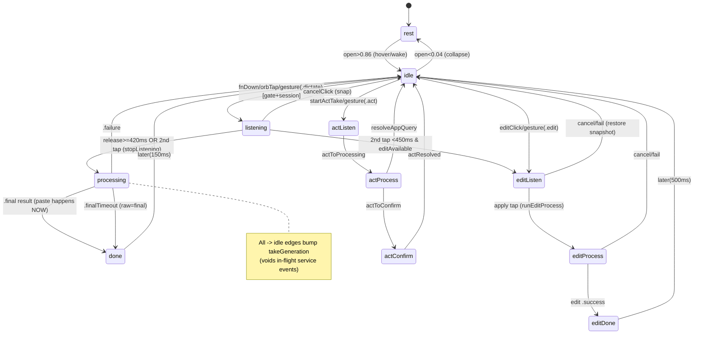

# MAP: orb-engine-behavior

Windows-only .NET port of `_reference/sarvam-kivi-electron/docs/maps/orb-engine-behavior.md`.
The engine is **pure, injected-time, platform-agnostic logic** — it ports to C# ~1:1 into
`Kivi.Core/Orb/*`. Every threshold, timer, cue mapping, and the dt-correction formula transfers
byte-exact. The render runtime + OS edges live in `Kivi.App` / `Kivi.Platform`.

---

# Kivi Orb — Behavioral Core / State Machine Map

**Scope:** the "brain" of the floating orb — a pure, frame-driven state machine. Rendering
(`Kivi.App/Views` + `Kivi.App/Drawing`) and OS integration (hotkeys, paste, mic) live outside
this scope.

---

## 1. Architecture at a glance

Three cooperating objects, all driven by ONE tick loop:

| Object (.NET) | Namespace | Role | Purity |
|---|---|---|---|
| `FlowEngine` | `Kivi.Core.Orb` | The state machine. Owns `Phase`, all animated scalars, timers, transcript model, service intake. `Step(long nowMs) → FlowFrame`. | **Pure logic, injected time.** No `DateTime.Now`/timers/dispatch. Deterministic frame-by-frame. |
| `KiwiMarkEngine` | `Kivi.Core.KiwiMark` (+ Win2D draw in `Kivi.App`) | Computes the "living dot-mark" kiwi (color/walk/breath per state). `Step(dt,target,inverted)` + a `Draw` step. | Pure state; the raster/draw is a thin Win2D wrapper. |
| `FlowRuntime` | `Kivi.App/Drawing` | The render-loop glue. Owns the rendering clock, calls `engine.Step()` each tick, drives the mark, publishes `FlowFrame`, wires the `CueBus`. | Windows-bound (Composition/DispatcherTimer/`CompositionTarget.Rendering`). |

**The core contract:** the engine is a **pure function of (accumulated input events) →
(per-frame `FlowFrame`)**. Every visual is derived in `Step()`, never animated by the view.
`FlowFrame` is the complete render output. **Views must be pure functions of `FlowFrame`.**

**Two design invariants:**
1. Every animated scalar eases toward a target with a per-frame lerp `value += (target − value)·k` inside one `Step()` call.
2. Every *timed* flow step is scheduled via `Later(ms)` guarded by a **generation counter** (`seq`); any new gesture calls `ClearTimers()` which bumps `seq` and voids all in-flight sequences.

**dt-correction (critical for cross-display parity):** lerp coefficients `k` were tuned at a 16 ms
tick. `Step()` computes `dtFrames = clamp((now-prev)/16, 0…3)` and `ease60(k) = 1 − pow(1−k,
dtFrames)`, so animations cover the same distance per unit *time* at any frame rate
(24/30/60/120 Hz). **The .NET port MUST replicate this** (`Math.Pow`) or morphs run at wrong
speeds on non-60 Hz displays.

---

## 2. The state model — `FlowPhase`

11 phases. Names mirror the reference verbatim.

```
rest, idle, listening, processing, done,
editListen, editProcess, editDone,          // edit sub-flow
actListen, actProcess, actConfirm            // act sub-flow (voice app-control)
```

Derived properties (needed as pure functions of phase):

| Property | True for | Used for |
|---|---|---|
| `IsActive` | all **except** `rest`, `idle` | keeps orb open + shows cancel satellite |
| `IsRecording` | `listening, processing, editListen, editProcess, actListen, actProcess` | mic-live gate; freezes box editability; fades non-cancel satellites; gates earcons |
| `MarkState` → `KiwiMarkState` | see table | which color/motion the kiwi bird shows |

**Phase → `KiwiMarkState`:**

| FlowPhase | KiwiMarkState | Visual |
|---|---|---|
| `listening` | `.listening` | orange, WALKS + voice-breath |
| `processing` | `.processing` | blue, STILL |
| `done`, `editDone` | `.done` | green, still pulse |
| `editListen` | `.speaking` | green, WALKS + voice-breath |
| `editProcess` | `.processing` | same blue "thinking" |
| `actListen`, `actProcess` | `.acting` | indigo, strides |
| `actConfirm` | `.confirming` | yellow, still (awaiting yes) |
| `rest`, `idle` | `.idle` | near-white/grey, still |

There is **no separate phase** for the transient cues `error`/`waiting`; those are driven by the
`MarkOverride` (§6.3), not by `phase`.

`Phase` is settable only inside the engine, and its **setter emits a `CueEvent`** on every real
change (the single mutation funnel; the cue system, tray icon, and earcon layer subscribe to this
one stream). In C#: a private field + a `SetPhase(newPhase)` method that fires the event on change.

---

## 3. State transition table

`→X` = sets `Phase = X`. Timers via `Later(ms)` are generation-guarded.

### 3.1 Dictation lifecycle (the MVP-critical path)

| From | To | Trigger (public API) | Guard | Side effects |
|---|---|---|---|---|
| `rest`/`idle`/`done`/`editDone` | `listening` | `OrbPointerDown()`, `FnDown()`, `Gesture(.Dictate)` | `DictationGate()` AND `SessionStartGate()` | `StartListening()`: `ClearTimers`, `OnTakeStart?()` (host captures target field), `micLevel=0`, `tx.awaitingSpeech=true`, hint "tap / release to transcribe", `cancelHideAt=now+2600`, `BeginTake(.Dictation)` (bumps `takeGeneration`, opens service sink) |
| `listening` | `processing` | `PointerUp()`/`FnUp()` when `heldFor ≥ holdMs(420)`; OR down again (second tap) when NOT a double-tap-edit | `phase==listening` | `StopListening()`: `ClearTimers`, `processingStartAt=now`, hint "transcribing", `ArmFinalTimeoutBudget()` (due `now+20000`), `dictation.RequestStop()`, box → processing |
| `listening` | `editListen` | second tap within `doubleTapMs(450)` of listen start AND `editAvailableBeforeTalk` | via `SecondTapAction()` | `StartVoiceEdit()` (§3.2) |
| `processing` | `done` | service emits `.Final(TakeResult)` | `phase==processing` | acceptance = resolution: `takeGeneration++` immediately, `CommitDictationToHost()` **pastes now**, then after `max(0, processingStartAt+250−now)` → `PresentDone()` |
| `processing` | `done` (notice) | `.Final` with empty raw+final | — | `PresentNoSpeech()` → "no speech detected" persistent notice |
| `done` | `idle` | `Later(150)` inside `PresentDone` | — | `ToIdle()`, `holdUntil=now+350`, `canEdit=true`; orb collapses ~0.5s later |
| `idle`/`rest`/`done`/`editDone` | `actListen` | `StartActTake()`, `Gesture(.Act)` | `DictationGate()` | act sub-flow |

**`PresentDone()`** is the resolution hub: resets review chain, `tx.RecordHistory()`,
`takeGeneration++`, `phase=done`, `takeRatable=true`, builds red→green diff, diff-morph if box
live else settle, schedules `ToIdle` at +150ms.

### 3.2 Edit lifecycle (voice-edit / preset-edit)

| From | To | Trigger | Notes |
|---|---|---|---|
| `idle`/`done`/etc. | `editListen` | `EditClick()`, `Gesture(.Edit)`, `StartVoiceEdit()`, second-tap-edit | snapshots prev, stashes `pendingSpokenEditBase`, box becomes a live listen surface, hint "say your edit, then tap", `BeginTake(.EditInstruction)` |
| `editListen` | `editProcess` | `OrbPointerDown`/`FnDown` (apply tap), `RunEditProcess()` | custom: **closes** capture, `spokenEditFlushDue=now+800`, waits for trailing finals. preset: `dictation.Cancel()`, `DispatchEdit()` immediately |
| `editProcess` | `editDone` | edit service `.Success(EditResult)` | `PresentEditDone()`: `takeGeneration++`, callbacks, `tx.ApplyEditResult()`, diff morph, `Later(500)→idle` |
| `editDone` | `idle` | `Later(500)` | fast collapse unless `editResultKeptInOrb` → 5s review hold |
| `editListen`/`editProcess` | `idle` | `CancelClick()`, `EditFailed()`, `EditCancelledRestore()` | restore pre-edit snapshot byte-exact (`tx.RestorePrev()`) |

`SecondTapAction()`: `if editAvailableBeforeTalk && now−listenStartAt < 450 → StartVoiceEdit()
else StopListening()`.

### 3.3 Act lifecycle (voice app-control)
Linear, app-owned parse/confirm:
```
idle/rest --StartActTake--> actListen --ActToProcessing--> actProcess
  --ActToConfirm--> actConfirm --ActResolved--> idle
actProcess --ResolveAppQuery(found)--> idle   (read-only query)
```

### 3.4 Cancel / new-session / failure edges (all → `idle`, snap, no walk-out)

| API / event | Effect |
|---|---|
| `CancelClick()` | if editing → `EditCancelledRestore()`; else `takeGeneration++`, `dictation.Cancel()`, `edit.CancelEdit()`, →idle, hint "cancelled", `Later(1000)→ToIdle`, `holdUntil=now+1800` |
| `NewSessionClick()` | void everything, clear box to empty editable, stay expanded+idle, hint "new session" |
| `.Failure(.Empty)` | `TakeFailedSoft()` → "didn't catch that — press again", yellow `.waiting` cue |
| `.Failure(.Network(keep:true))` / `.Server` w/ segments | `TakeFailedKeepRaw()` → lands raw transcript in box, `.recoveredRaw` cue, banner "saved what we heard — copy from here" (+"— retry" if `canRetry`) |
| `.Failure(.FinalTimeout)` / budget elapsed | `TakeFinalTimeout()` → raw IS final, paste it, `PresentDone(hint:"cleanup…")` |
| `.Failure(.IdleTimeout)` | `PresentIdleTimeout()` → persistent "Idle timeout" notice |
| `.Failure(.UsageLimit)` | `TakeFailedSoft("monthly words used up", cue:.limitHit)` |
| `.Failure(.Unauthorized)` | `TakeFailedSoft("sign in to use kivi")` |
| `ManualRetryFailedTake()` | `dictation.BeginRetry()`, re-enter `processing` on fresh generation |

**Geometry-driven auto transitions** (inside `Step()`):
- `open > 0.86 && phase==rest` → `ToIdle()`
- `open < 0.04 && phase∈{idle,rest}` → `phase=rest`, `ClearTimers()`, reset `canEdit/editOpen/hintHidden/editResultKeptInOrb`

### 3.5 State diagram



---

## 4. Input event surface (the public API the .NET shell must call)

The shell (`Kivi.App/DictationOrchestrator` + `Kivi.Platform`) translates OS events into these
engine calls. The engine never touches the OS.

**Talk gestures** (pointer and hotkey are mirrored):
- `OrbPointerDown()` / `PointerUp()` — mouse on the orb
- `FnDown()` / `FnUp()` — global hotkey. `FnDown` ignores auto-repeat via `fnHeld`
- Gesture classification is **pure-time** ("gesture is the only take authority; VAD/dB drive ANIMATION ONLY"):
  - hold ≥ `holdMs` (420) then release → `processing`
  - quick tap (< 420) → take stays alive until a **second tap** stops it
  - second tap < `doubleTapMs` (450) of start + edit-available → **voice edit**
- `Gesture(ShortcutAction)` — single funnel: `.Dictate/.Edit/.Act/.Cancel/.Home/.QuickSearch/.DeepSearch`

**Hover:** `MouseMoved(x,y,moved)`, `UpdateHover(target)`, `GroupEnter/Leave()`, satellite enter/leave.

**Clicks:** `EditClick()`, `SettingsClick()`, `ExpandClick()`, `CollapseClick()`, `CancelClick()`,
`NewSessionClick()`, `HintCloseClick()`, `CopyClick()→string`, `Prev/Next/PagerSelect()`,
`PlaybackClick()`, `ManualPasteClick()`, `RegenerateClick()`, `RateTake(up)`, `PaneSelect()`.

**Text/box:** `BeginTyping()`, `EditorTextChanged()`, `TypedTextChanged()`, `Paste()`,
`Resize(w,h)`, `FitBoxToContent()`, `SetExpanded()`, `AddBoxHost()/RemoveBoxHost()`.

**Geometry hints from shell:** `SetBoxSide(onLeft)`, `SetEdgeRoom(left,right)`, `SetVerticalFlip()`,
`SetTakeHostApp(appKey)`, `ShowSelectionPill()`, `OrbLightTarget(nx,ny)` (specular highlight tracks
cursor).

**Live signal:** `MicLevel` (0…1, from the mic meter — drives listen-breath **animation only**).

**Host callbacks (engine → shell), as C# events / delegates:** `OnTakeStart`,
`OnDictationCommit(WithContext)`, `OnStateTransition`, `OnExternalEditResult`, `OnEditCommitted`,
`OnManualPasteRequested`, `OnOpenKivi`, `OnFocusBoxRequested`, `OnServiceWorkEnqueued`,
`OnPrepareExternalEditTarget[Async]`, `OnRecallLatestHistory`, `OnTakeRated`, `OnBarDrag*`.

---

## 5. Service seam — how transcript data flows in

The engine talks to the STT/edit backend through two injected interfaces (`Kivi.Core/Contracts`),
never directly. This is the seam wired to the same `kivi-service` WebSocket.

### 5.1 `IDictationService`
```
Begin(TakeKind kind, ContextMessage ctx, bool renderActive, Action<DictationEvent> sink)
RequestStop(EndOfSpeechInfo)      // resolve with .Final or .Failure
Cancel() / Cancel(reason)         // engine drops stragglers by generation
Tick(long now)                    // frame-driven demo advances here; live adapters no-op
ResyncRender()
BeginRetry(sink) -> bool          // replay retained audio
CanRetry
```
`TakeKind`: `.Dictation` / `.EditInstruction`.

### 5.2 `DictationEvent` (inbound stream) → engine reaction (`Handle()`)

| Event | Engine reaction |
|---|---|
| `.Opened(sessionID)` | no-op |
| `.SpeechStart` | `TxBeginSpeech()` (flip "speak now" → animated dots) |
| `.Segment(index, text)` | accumulate by index (resync-safe, backfill-bounded to 1024); if box live → `ShowChunkLine()` |
| `.FormattingBudget/Progress` | extend `finalTimeoutDue` (capped at EOS+120s); staged hint |
| `.Final(TakeResult)` | **acceptance = resolution**: `takeGeneration++`, `CommitDictationToHost()` (paste), then `PresentDone()` after 250ms min-display |
| `.Retrying(attempt)` | recolor processing → "hmm — retrying…", re-arm budget |
| `.LateFinal*` | late-final REST recovery copy |
| `.LinkStatus(.Interrupted/.Lost/.Restored)` | banner + hint; take **keeps recording locally** |
| `.Failure(TakeFailure)` | routes per §3.4 |

`TakeResult`: `{ RawSegments:string[], FinalLines:string[], DiffLines:TxTokenLite[][]?,
AudioDegraded:bool, PasteContext, LatencyTrace, … }`. Live sends `DiffLines=null`; the engine
computes a word-level LCS diff itself (bounded at `maxDiffTokenProduct=1_000_000`).

### 5.3 Generation-guarded intake (thread safety)
Services may call `sink` from **any thread** (the WS receive loop runs on a thread-pool thread).
`EnqueueServiceEvent(generation, intake)` appends under a lock + fires `OnServiceWorkEnqueued`
(revives a parked render loop). `DrainServiceEvents()` runs at the **top of `Step()`**, FIFO,
dropping any item whose `generation != takeGeneration`. So every start/cancel/resolve that bumps
`takeGeneration` instantly voids all stale in-flight events. **In .NET use a
`ConcurrentQueue`/lock** (the render loop drains synchronously at frame top; the WS `onmessage`
enqueues). Keep the **generation-tagging** — it is the correctness backbone.

---

## 6. The cue / event bus

### 6.1 `CueEvent`
`struct CueEvent { CueEventKind Kind; FlowPhase From; FlowPhase To; }`. Emitted from the phase
setter and from transient non-phase paths via `EmitCue()` (from==to): `.noTarget`, `.copied`,
`.error`, `.recoveredRaw`, `.resultReady`.

### 6.2 `CueEventKind` → `CueSpec` catalog (`CueCatalog`)
Every event maps to **(CueColorRole, MotionPrimitive, EarconID)** + a (dropped) haptic. Reproduce
as a lookup table.

| CueEventKind | Color role | Motion | Earcon | (Haptic — dropped) |
|---|---|---|---|---|
| idle | idle | still | none | — |
| listening | listening | breathe | **start** | (startListening) |
| processing | processing | walk | **stop** | (stopListening) |
| done | speaking | pulse | complete | (success) |
| editListen | speaking | breathe | start | (startListening) |
| editProcess | processing | walk | stop | (stopListening) |
| editDone | speaking | pulse | complete | (success) |
| acting | processing | walk | none | — |
| confirming | waiting | still | none | — |
| searchThinking | processing | shimmer | none | — |
| resultReady | speaking | pulse | complete | (success) |
| error | error | pulse | error | (error) |
| waiting | waiting | breathe | soften | (softRetry) |
| noTarget | waiting | jitter | notify | (attention) |
| recoveredRaw | waiting | pulse | soften | (recoverableFallback) |
| limitHit | waiting | pulse | blocked | (blocked) |
| languageMismatch | waiting | pulse | soften | (softRetry) |
| cancelled | idle | still | none | — |
| saved / copied | ink | pulse | none | — |
| discoveredItem | ink | shimmer | none | — |

`MotionPrimitive`: `still, breathe, pulse, walk, jitter, wash, shimmer`.
`EarconID` (closed set, **no TTS path ever**): `none, start, stop, complete, soften, error,
blocked, notify`.
`CueColorRole` → a KDS theme token (resolves per light/dark).
`CueSpec.Resolved(reduceMotion)` collapses motion to `.still` but keeps color+earcon.

### 6.3 `CueBus` + gates
`publish(event)` sets `Last`, raises an event, then plays earcon through gates:
- **Earcon rule**: never mid-recording EXCEPT `.start`/`.stop` boundaries. Refractory **0.25 s** per id. `.start` is **deferred to the next loop turn** so the audio player can't contend with mic warm-up and swallow first words.
- **Haptics: DROPPED** (no desktop analog on Windows). Keep the cue-catalog haptic column as documentation only; never wire it.
- Players default to **no-op** (silent); the shell installs a lightweight audio player for the bundled earcon tones.

### 6.4 `MarkOverride`
A **frame-counted** transient mark override (no clock → pure). Cues with no `FlowPhase` of their
own — `error/waiting/acting/confirming` — wash the orb's mark for **90 frames** so a failure
visibly washes RED instead of collapsing to grey idle. `OverrideMarkState(for)` maps `.error→.error`,
`.acting→.acting`, `.confirming→.confirming`, `.waiting/.limitHit/.noTarget/.languageMismatch/.recoveredRaw→.waiting`.
`Tick(base)`: any non-idle base phase supersedes and clears the override.

---

## 7. Hover model (single geometric classifier)

Hover is computed **purely from geometry every tick** — there is NO framework `.OnHover`.
`HoverTarget`: `orb, satEdit, satCancel, satSettings, satExpand, pane, hint, box, dragHandle,
field`. `IsCompanion` (everything but `orb`/`box`/`dragHandle`) = hovering it keeps the orb open.

`FlowFrame.InteractiveTarget(flowX, flowY) -> HoverTarget?` is the single source for BOTH
click-through (`IsInteractive`) and hover, checked topmost-first (z-order): pane → satellites →
drag handle → orb (rounded-rect SDF, +2px) → hint → box → `.field` (lowest priority). Each region
matches the *drawn* shape (rounded orb via `OrbShapeContains`, satellite circles at 1.5× radius),
never a bounding box; invisible satellites (opacity ≤ 0.08) reserve no area.

Orb wake uses **hysteresis** (2px enter / 10px leave on the currently-visible bounds), NOT a fixed
ring. `groupHover` (from companions) extends open with a **150ms** leave debounce.

The shell polls the live cursor every tick (`GetCursorPos`) and calls `UpdateHover()` — race-free,
no fragile mouse-move events. **This same function drives the layered window's click-through toggle
(`WS_EX_TRANSPARENT` / `SetWindowLong` or per-frame hit-test) — keep it unified.**

---

## 8. Timers & debounces (exhaustive)

Two timer systems + budget timers, all evaluated at the top of `Step()` against injected `now`.

### 8.1 Generation-guarded sequence timers (`Later`/`ClearTimers`)
```
seq: int; scheduled: [{due, generation, fire}]
Later(ms, fn)     → append {now+ms, seq, fn}
ClearTimers()     → seq++; scheduled.Clear()   // voids ALL pending
```
In `Step()`: fire all `scheduled` where `due ≤ now && generation == seq`. Used for every settle
beat (done→idle, cancel→ToIdle, editDone→idle, notice dwell, delayed hint text).

### 8.2 Transient (non-voided) leave/debounce timers — re-arming replaces prior
`groupLeaveAt (150ms)`, `editPaneCloseAt (280ms)`, `satSettingsLeaveAt/satExpandLeaveAt/satCancelLeaveAt (500ms)`.

### 8.3 Budget timers (absolute deadlines)
- `finalTimeoutDue = now + finalTimeoutMs(20_000)` — no correction within budget → `TakeFinalTimeout()`. Extendable by formatting budget, capped at `formattingProgressAbsoluteCapMs(120_000)`.
- `spokenEditFlushDue = now + spokenEditFlushMs(800)`.
- `holdTimerDue = now + silenceRevertMs(8000)` — reverts trailing dots to standalone "listening…".
- Processing hints (once each): `processingStillWorkingMs(3000)` → "still working…", `processingLongerThanUsualMs(9000)` → "taking longer than usual".

### 8.4 Hold windows (`holdUntil`, `*HideAt`) — timestamps compared to `now` inside `Step()`

| Const | Value | Meaning |
|---|---|---|
| `holdMs` | 420 | tap↔hold gesture cliff |
| `doubleTapMs` | 450 | second-tap-edit window |
| `longHoldMs` | 600 | act/confirm long-hold (ordering invariant `600>450>420`) |
| `processingMinDisplayMs` | 250 | min on-screen processing |
| `editReviewHold` | 5000 | edit-kept-in-orb review window |
| `popDimMs` / `cancelHideAt` | 2600 | satellite reveal window |
| `expFaintUntil` | now+4000 | expand satellite faint-glow after done |
| done→idle | 150 | then `holdUntil=now+350` |
| editDone→idle | 500 | then `holdUntil=now+600` (or 5000 if kept) |
| cancel→ToIdle | 1000 | `holdUntil=now+1800` |
| keep-raw dwell | 2600 / **7000** (retry offered) | banner linger |

### 8.5 Render loop / power management (`FlowRuntime`, Windows)
- **3-tier adaptive band**: `rest(24fps) / steady(30fps) / morph(60fps)`. Tier chosen by a `geometrySignature` diff — only structural geometry (open/exp/box/drop/press/shakes/diff/toast) forces `morph`; continuous animators (breath, glow) excluded so steady listening stays at 30fps.
- **0-fps rest park**: after `parkAfterSettledTicks(48)` settled resting frames the render loop is **torn down entirely** (a resting pill renders nothing). Revival is event-driven (`Nudge()` on every input edge, `OnServiceWorkEnqueued`, `needsRuntimeTicks`). A **1 Hz `restHeartbeat`** keeps the engine clock honest while parked (else a take born on a long-parked orb computes deadlines against a stale clock and expires them instantly).
- **`Nudge()`**: renders NOW in the same loop pass as the input edge (not waiting for the next frame) — critical for "did it start recording?" latency; unparks, steps once, retunes to the 120fps band.
- `needsRuntimeTicks`: true when `phase.IsActive || done/editDone || any timer pending`.
- **.NET mapping:** drive the loop with `CompositionTarget.Rendering` (per-frame, DPI/refresh-aware) or a `DispatcherTimer`; park by unsubscribing `Rendering`; the 1 Hz heartbeat is a low-freq timer. Replicate the dt-correction so tier changes don't alter motion speed.

---

## 9. Transcript data flow (`Transcript`)

`TranscriptModel` (value type / struct-like; engine mutates, view reads a per-frame copy in
`FlowFrame`).

### 9.1 Stages (`TxStage`) & line roles
`TxStage`: `idle, listen, wave, done, editPlain, editWave, typed, pasted`.
`TxLineRole`: `waiting` (italic "listening…"), `speaking` (active chunk + dots), `final`, `dim`
(0.34), `plain`, `tokens([TxToken])` (diff line). `TxToken.Kind`: `same/del/ins/final`.

### 9.2 Live streaming path
`txSession` is a generation counter for chunk callbacks. Sequence:
1. `StartListening` → `TxStartListen()`: stage=listen, one `.waiting` line, `awaitingSpeech=true`, no dots.
2. `.SpeechStart` → `TxBeginSpeech()`: `awaitingSpeech=false`, `dotsStartedAt=now` (dots at `dotsMs=600` cadence, 1–3 dots).
3. `.Segment` → `ShowChunkLine(text)`: prior `speaking`→`final`, all `final`→`dim`, append new `.speaking` line with `fadeInStart=now` (240ms fade). Arms `holdTimerDue=now+8000`.
4. Silence > 8s → revert to standalone `.waiting`. Fresh `.SpeechStart` → re-attach dots.
5. `StopListening` → `TxToProcessing()`: finalize lines, `Later(460)→stage=wave`.
6. `PresentDone` → `TxDiff()`: settle on clean final, start diff morph.

### 9.3 Review frames & `TakeSource`
`TakeSource {Raw:string[], Final:string[], Diff:TxToken[][]?}`. Back/forward walks frames: **0**
raw → **1** diff → **2** clean final (→ **3** refine if edited). Live takes carry `Diff==null`.

### 9.4 Diff morph (pure render overlay)
`DiffMorph {StartedAt, Lines}`. Animates its OWN diff tokens for **150+100+250 = 500ms**
(compressed from the source's `diffMs/diffHoldMs/diffSettleMs` 520/1050/620 so it never outlasts
the snappy collapse). `DiffProgress {landing, landingEased, collapse}` computed per frame; clears
at 500ms. Skipped under `reduceMotion`.

### 9.5 Editability
`EditableContent` (pure fn of stage+lines+morph): editable when `idle/typed/pasted`, or `done`
with morph cleared and no del/ins tokens; read-only during `listen/wave/editPlain/editWave` or an
animating diff. `FlowFrame.TxEditable = EditableContent && !phase.IsRecording`.

### 9.6 History / playback
`RecordHistory()` at done (plain, dedup-by-text, max 24, persisted via `IFlowStore`).
`RecallLast()`, `LoadSession()`, `HistoryStep(±1)`. Edit chains build `baseFrames` walking
dictation→edit1→edit2. `IFlowStore`: a settings-backed store (**JSON under `%APPDATA%\Kivi`** —
reuse the reference key names `flowPage`, `flowOrbStyle`, `kiviFlowPlayback`, …) /
`MemoryFlowStore` (tests).

---

## 10. The mark render engine (`KiwiMarkEngine` + `SpeechPace` + `KiwiData`)

Stepped only when `markOpacity > 0.001`.

- **`KiwiData`**: a 120×162 static silhouette bitmask (19440 chars, `'1'`=inside), row-major from top. `MaskOn(x,y)`. Byte-exact port (embed the mask string).
- **`KiwiMarkEngine`**: rasterizes the bird as a grid of dots. Two state tables (`darkTable`/`lightTable`) keyed by `KiwiMarkState`, each `{col:RGB, walk:0/1, listen:0/1, alpha, dot, bd/bl (breath colors)}`. `Step(dt,target,inverted)` lerps toward the target spec (dt-corrected `k = 1−pow(1−0.12, dt/0.016)`; `.listening` color uses faster `0.30/tick`). Walk clock advances `dt·(2.2 + 5.5·walk)`. **Gait raster cache**: 48 phase × 8 amplitude buckets, rasterized once each (perf).
- **State colors** (dark table, RGB): idle `(250,252,246)`, listening `(248,168,108)` orange, processing `(120,140,255)` blue, editing `(242,200,104)`, speaking `(156,206,108)` green, done `(166,214,118)`, error `(184,21,20)`, waiting `(210,150,45)`, acting `(66,80,213)` indigo, confirming `(210,150,45)`.
- **`SpeechPace`**: the GAIT model — a Schmitt-triggered two-pace state (calm amble ↔ brisk trot). `onLevel=0.30, offLevel=0.12, onConfirm=0.10s, silenceHold=0.90s, riseTau=0.28s, fallTau=0.85s`. Fed `(level, dt)`, outputs `pace 0…1` (smoothstep-eased). While listening/speaking: `walkDrive=0.45+1.30·pace`, `speechGlow=pace`, `listenLevel=0.16+1.55·rawMicLevel`. **The kiwi walks from the first listening frame — the stride IS the "recording is live" signal; VAD never gates it.**
- **`reduceMotion`**: snaps mark to target (k=1), freezes walk clock; `freezeWalk` (showcase) freezes gait but keeps color lerp.

The **draw** is a thin Win2D wrapper in `Kivi.App/Drawing` (dot compositing into a 65px canvas,
coverage-readback for the numeric gate). JS/Win2D canvas is top-left origin (like the reference's
Electron canvas), so no bottom-left-origin flip is needed.

---

## 11. `FlowFrame` — the render output contract

~90 fields consumed by the renderer: time (`now`, `breath = 0.5+0.5·sin(2π·t/2.6s)`), phase+mark
(`phase, markState, inverted`), orb geometry (`open, orbWidth/Height/Radius, drop, press`),
fill/glow (`fillAlpha, backdropBlur, glowCore/Halo/Color, dropShadow, markOpacity, lightX/Y`),
eyes, hint pills, satellites, edit pane, expansion/transcript (`exp, expanded, flowShiftX,
txWrap*, boxW/H, boxGrowUp, boxOnLeft, flipY`), transcript content (`txStage, txLines, txDots,
txWaitingPhase, txNotice, txBanner, diffProgress, scrollCommand, txEditable, txEditorSeed`), hover
(`hoveredTarget`), turn-surface chrome (`bandCanPrev/Next, txPagerIndex/Count, retryOffered,
takeRating, takeRatable, hasEditChain, editContextKind/Preview, copyFlash/Hint`), toast, settings.

Geometry helpers on `FlowFrame` (pure, shared by view + hit-test): `BoxTopOffset`,
`SatellitePlacement()`, `FlipFlowY()`, `BoxLocalX()`, `IsOverBoxContent()`, `InteractiveTarget()`,
`OrbShapeContains()`.

Key geometry constants: `restSize=(39,15,7.5)`, `wakeSize=(61,61,30.5)`,
`wakeSizeMini=(42.7,42.7,21.35)`, `boxDefault=(322,108)`, `boxMax=(640,360)`, `flowShift=159`.

---

## 12. `Step(long now)` pipeline (one frame, in order)

1. `now = newNow`; compute `dtFrames`, `ease60`.
2. `dictation.Tick(now)`, `edit.Tick(now)`.
3. Fire due `scheduled` sequences (generation-guarded).
4. `DrainServiceEvents()` — FIFO, generation-filtered.
5. `TickMicHealth()` — pre-speech waiting escalation (0 "speak now" → 1 "are you there?" @5s → 2 "mic may not be working" @10s → 3 "check mic" @20s).
6. Processing staged hints; `finalTimeoutDue`/`spokenEditFlushDue`/`holdTimerDue` checks.
7. Transient leave-timer checks.
8. Build fresh `FlowFrame`: compute `wantOpen`, ease `open`/`exp`, geometry-driven phase transitions, edge-shift, satellite/hint/glow/eye scalars, transcript copy, diff progress, band flags.
9. Return `f`. (`FlowRuntime` then resolves mark override, steps `KiwiMarkEngine`, publishes, updates rest-park, polls cursor.)

---

## Windows/.NET notes (macOS/Electron → Windows/.NET)

The state machine (`FlowEngine`, `FlowFrame`, `Transcript`, `CueBus`, `SpeechPace`, cue catalog)
is **pure logic with injected time** — it ports to C# almost 1:1 into `Kivi.Core`. The bound
pieces are in `FlowRuntime` and the render/OS edges:

1. **Render loop** (`CADisplayLink`/`requestAnimationFrame`) → **`CompositionTarget.Rendering`** (or a `DispatcherTimer`). **Must replicate dt-correction** (`ease60(k)=1−pow(1−k, dt/16)`, `Math.Pow`). Replicate the **3-tier band** (24/30/60) and **0-fps rest park + 1Hz heartbeat**; the "render in the same pass as the input edge" (`Nudge`) matters for perceived latency.
2. **Global hotkey** → `WH_KEYBOARD_LL` on a dedicated thread. No `fn` on Windows; default Right-Ctrl hold. Feed edges to `FnDown()/FnUp()`; the **pure-time gesture classifier** (420/450/600) ports as-is.
3. **Paste into active app** (`OnDictationCommit` → synth Ctrl+V) → `SendInput` (see `dictation-audio-pipeline.md §8`). UI Automation readback deferred. The "keep-in-orb + copy from here" recovery flow is the portable fallback when synthesis is blocked (secure fields).
4. **Mic level meter** → WASAPI capture + an RMS meter for `MicLevel`; the engine only consumes a 0…1 scalar and the `DictationEvent` stream. Remember `MicLevel` drives **animation only** — never take fate.
5. **Earcons/haptics** → **haptics dropped** (no desktop analog). Earcons: a lightweight audio player. Keep the **mid-recording earcon gate**, the **0.25s refractory**, and the **deferred `.start`**.
6. **Click-through window** — `FlowFrame.InteractiveTarget(x,y)` decides per-tick whether the layered overlay swallows or passes clicks. Windows: toggle `WS_EX_TRANSPARENT` (or region hit-testing) polled each tick from `InteractiveTarget()`. Fully portable and load-bearing (no `.OnHover` fallback).
7. **The dot-mark render** → Win2D / `Microsoft.Graphics.Canvas`. Port `KiwiData` mask + state color tables + `SpeechPace` verbatim; keep the 48×8 gait-raster bucket cache. Canvas is top-left origin — no coordinate flip needed.
8. **Persistence** (`IFlowStore`) → JSON under `%APPDATA%\Kivi`; reuse the reference key names (`flowPage`, `flowOrbStyle`, `kiviFlowPlayback`, …).
9. **Theming** — `FlowSettings.Page` (light/dark), `Orb` (forest/mist); cue colors resolve through `CueColorRole` → KDS theme keypaths. Port the KDS token tables so light/dark + cue colors match exactly (see `design-tokens.md`).
10. **Threading** — the reference's lock guards `pendingServiceEvents` because services call back off-main. In .NET the WS receive loop is a thread-pool thread, so keep a `lock`/`ConcurrentQueue`; the queue-drained-at-frame-top pattern applies. Keep the **generation-tagging** (`takeGeneration`) — it is the correctness backbone.

**Bottom line for the port:** lift `FlowEngine`/`FlowFrame`/`Transcript`/`CueBus`/`SpeechPace`/
cue-catalog as pure C# in `Kivi.Core.Orb` driven by a `CompositionTarget.Rendering` clock;
implement a thin `Kivi.Platform` shell for hotkey, paste, mic, click-through, and Win2D rendering
that calls the same public API and consumes `FlowFrame`. The trimmed transcription MVP needs only:
`FnDown/FnUp` → `listening`/`processing`, the `IDictationService` seam wired to the kivi-service
WS, `.Final` → `CommitDictationToHost` → paste, and the `listening/processing/done` mark states.

**Deferred / v1 non-goals:** act sub-flow (voice app-control) is post-MVP; in-box editing M4;
UIA caret snapshot for join-rewrite M4/M9.

> **Not applicable — Windows-only.** The reference's Linux/Wayland paste and hotkey caveats are
> dropped.
