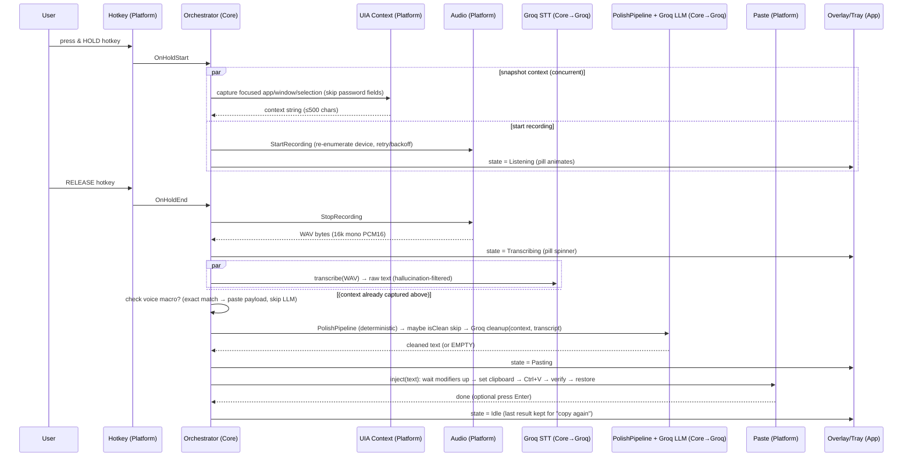

# Kivi for Windows — System Design

> **Purpose.** The single top-level map of the application: what the projects are, where every
> piece of code lives, how the pieces depend on each other, and the end-to-end runtime flow of a
> dictation. Read this first to understand the whole; then drill into the per-area docs.
>
> **Companion docs:**
> [`overview.md`](overview.md) (why/what) ·
> [`freeflow-research.md`](freeflow-research.md) (decisions + reuse boundary) ·
> [`impl-01-screen-context-uia.md`](impl-01-screen-context-uia.md) ·
> [`impl-02-audio-driver-resilience.md`](impl-02-audio-driver-resilience.md) ·
> [`impl-03-winui3-kivi-ui.md`](impl-03-winui3-kivi-ui.md)

---

## 1. One-paragraph summary

Kivi-for-Windows is a **tray-resident push-to-talk dictation app**. You hold a hotkey, speak, and
release; the app records your mic, sends the audio to **Groq** (OpenAI-compatible Whisper STT),
sends the raw transcript plus **on-screen context** to a **Groq LLM for cleanup**, then **pastes**
the polished text into whatever app had focus. It is a Windows-native **.NET 8/9** port of the
macOS **FreeFlow** engine, wearing a **WinUI 3 "Kivi" skin**. There is **no Kivi server in this
phase** — the app is a thin client that calls Groq's hosted API directly with the user's key.

---

## 2. Design principles (the rules that shape everything)

1. **Engine is the core, UI is the skin.** Pipeline logic lives in `Kivi.Core`; the WinUI 3 layer
   only observes state and issues commands. Reskinning must never require touching pipeline code.
2. **Wrap the backend, don't rebuild it.** The "backend" is Groq's OpenAI-compatible REST API. We
   reuse its contract, model IDs, and FreeFlow's prompts verbatim (translated to C#).
3. **Swap seams from day one.** STT and cleanup sit behind `ISttEngine` / `IPolishClient`. Groq
   today; Kivi's real backend later is a config/adapter change, not a rewrite.
4. **Reuse platform-agnostic logic, reimplement only OS glue.** Prompts, cleanup regexes,
   hallucination filter, macro/vocab logic → ported. Hotkey, mic, paste, context, secrets → new,
   Windows-native.
5. **Resilience over assumptions.** Never cache device handles; re-enumerate at session start;
   treat mic/driver hiccups as transient (retry/backoff); never read password fields.
6. **Native + lean.** No Electron/webview. Target **<100 MB RSS**, ~zero idle CPU.

---

## 3. Project structure (the three assemblies)

The solution is **three projects** with a strict dependency direction. `Kivi.Core` knows nothing
about Windows or WinUI; `Kivi.Platform` is Windows-native but UI-less; `Kivi.App` is the WinUI 3
skin and the composition root.

```
Kivi.sln
│
├── Kivi.Core/                    ← portable engine. Pure C#. NO Windows/UI deps. Unit-testable.
│   │                               (This is the "reuse verbatim from FreeFlow" layer.)
│   ├── Http/
│   │   └── OpenAiCompatibleClient.cs   # HttpClient: /audio/transcriptions + /chat/completions
│   ├── Stt/
│   │   ├── ISttEngine.cs                # swap seam (Groq now, Kivi later)
│   │   └── GroqSttEngine.cs             # multipart WAV upload; no_speech_prob hallucination filter
│   ├── Polish/
│   │   ├── IPolishClient.cs             # swap seam
│   │   ├── GroqPolishClient.cs          # chat/completions; model fallback + cooldown + injection guard
│   │   └── PolishPipeline.cs            # deterministic regex cleanup (ported from mrinalwadhwa fork)
│   ├── Prompts/
│   │   └── Prompts.cs                   # ported FreeFlow system + user-message prompts (constants)
│   ├── Macros/
│   │   ├── VoiceMacro.cs                # exact-match macros, "press enter" command parsing
│   │   └── Vocabulary.cs                # custom-vocab merge → appended to cleanup prompt
│   ├── Orchestration/
│   │   ├── IDictationOrchestrator.cs
│   │   ├── DictationOrchestrator.cs     # port of FreeFlow AppState — drives the whole pipeline
│   │   └── RecordingState.cs            # Idle | Listening | Transcribing | Pasting | Error
│   ├── Abstractions/                    # interfaces Kivi.Platform implements, so Core stays OS-free
│   │   ├── IAudioCaptureService.cs
│   │   ├── IHotkeyService.cs
│   │   ├── IPasteService.cs
│   │   ├── IScreenContextProvider.cs
│   │   └── ISecretStore.cs
│   └── Config/
│       └── AppConfig.cs                 # base URLs, model IDs, hotkey, mic, timeouts, vocab, macros
│
├── Kivi.Platform/                ← Windows-native OS glue. Implements Kivi.Core.Abstractions.
│   │                               (This is the "reimplement per impl-01/02" layer.)
│   ├── Audio/
│   │   ├── WasapiAudioCaptureService.cs # NAudio WasapiCapture → 16k mono PCM16 WAV   [impl-02]
│   │   └── DeviceNotificationClient.cs  # IMMNotificationClient → Channel (non-blocking) [impl-02]
│   ├── Hotkey/
│   │   └── LowLevelKeyboardHookService.cs # SetWindowsHookEx WH_KEYBOARD_LL (non-suppressing)
│   ├── Paste/
│   │   └── SendInputPasteService.cs     # clipboard + Ctrl+V; 4 safeguards (modifier-wait, verify…)
│   ├── Context/
│   │   └── UiaScreenContextProvider.cs  # UIA3 focused elem + TextPattern; SKIP password fields [impl-01]
│   ├── Secrets/
│   │   └── DpapiSecretStore.cs          # ProtectedData (DPAPI) for the API key
│   └── Interop/
│       └── NativeMethods.txt            # CsWin32 generation manifest
│
└── Kivi.App/                     ← THE SKIN. WinUI 3, unpackaged. Composition root.   [impl-03]
    ├── App.xaml(.cs)                    # DI wiring; shows resident tray; no main window
    ├── Themes/
    │   ├── Tokens.xaml                  # ← design tokens; the ONE file a reskin mostly touches
    │   ├── Controls.xaml                # control-template overrides (consume tokens)
    │   └── Icons.xaml
    ├── ViewModels/                      # OverlayViewModel, TrayViewModel, SettingsViewModel
    ├── Views/
    │   ├── TrayWindow.xaml(.cs)         # resident host owning the H.NotifyIcon
    │   ├── OverlayWindow.xaml(.cs)      # borderless topmost click-through pill
    │   └── SettingsWindow.xaml(.cs)     # NavigationView + Settings/*Page.xaml
    ├── Controls/                        # HotkeyCaptureBox, waveform pill, …
    ├── Interop/NativeMethods.cs         # SetWindowLongPtr, WS_EX_*, GetCursorPos
    └── Assets/                          # tray icons, glyphs

Kivi.Core.Tests/                 ← unit tests for the engine (fake HttpMessageHandler; no hardware).
```

**Dependency direction (must not be violated):**

```
Kivi.App  ──▶  Kivi.Platform  ──▶  Kivi.Core
   │                                   ▲
   └───────────────────────────────────┘   (App also refs Core: state enums, config, orchestrator)
```

`Kivi.Core` depends on **nothing** in the other two — it references `Kivi.Platform`'s services only
through the `Kivi.Core.Abstractions.*` interfaces, which `Kivi.Platform` implements and the
composition root (`Kivi.App`) injects. This is what keeps the engine portable and testable, and what
lets a future real-Kivi build reuse `Kivi.Core` unchanged.

---

## 4. Component responsibilities (who owns what)

| Component | Project | Responsibility | Impl doc |
|---|---|---|---|
| `OpenAiCompatibleClient` | Core | Raw HTTP to `/audio/transcriptions` + `/chat/completions` | research |
| `GroqSttEngine` (`ISttEngine`) | Core | STT call + hallucination filter | research |
| `GroqPolishClient` (`IPolishClient`) | Core | Cleanup call + fallback/cooldown/injection guard | research |
| `PolishPipeline` | Core | Deterministic pre-LLM cleanup (regex); optional `isClean` skip | research |
| `Prompts` | Core | Ported FreeFlow prompt strings | research |
| `DictationOrchestrator` | Core | Sequences the whole pipeline; owns `RecordingState` | research |
| `AppConfig` | Core | All settings + defaults | research |
| `WasapiAudioCaptureService` | Platform | Mic → 16k mono PCM16 WAV; device resilience | **impl-02** |
| `DeviceNotificationClient` | Platform | `IMMNotificationClient` device events | **impl-02** |
| `LowLevelKeyboardHookService` | Platform | Global hold-to-talk hotkey | research |
| `SendInputPasteService` | Platform | Clipboard + Ctrl+V with 4 safeguards | research |
| `UiaScreenContextProvider` | Platform | Focused-field context; password-skip | **impl-01** |
| `DpapiSecretStore` | Platform | API-key at rest (DPAPI) | research |
| Overlay / Tray / Settings | App | Presentation only, MVVM over orchestrator state | **impl-03** |
| `Tokens.xaml` | App | The reskin surface | **impl-03** |

---

## 5. End-to-end runtime flow (one dictation)



**Narrated:**
1. **Hold-start.** The low-level keyboard hook fires `OnHoldStart`. The orchestrator does two
   things concurrently: **snapshots screen context** via UIA (focused app + window title + selected
   text, *never* password fields — [impl-01]) and **starts recording** (re-enumerate the default
   capture device, init with retry/backoff — [impl-02]). Overlay goes to **Listening**.
2. **Hold-end.** Release fires `OnHoldEnd`; recording stops and returns **WAV bytes**. Overlay →
   **Transcribing**.
3. **STT.** `GroqSttEngine` POSTs the WAV (multipart) to Groq; the response text is run through the
   `no_speech_prob` hallucination filter.
4. **Macro shortcut.** If the normalized transcript exactly matches a voice macro, its payload is
   pasted directly and the LLM is skipped.
5. **Cleanup.** Otherwise `PolishPipeline` does deterministic regex cleanup; an optional `isClean`
   heuristic may skip the LLM entirely; else `GroqPolishClient` sends `{context + transcript}` to
   the cleanup model (with fallback/cooldown/injection-guard). Custom vocabulary is appended to the
   system prompt.
6. **Paste.** `SendInputPasteService` applies the four safeguards — wait for hotkey modifiers to
   release, set clipboard, Ctrl+V, verify/rewrite, 400 ms delay, restore prior clipboard — then
   optionally presses Enter. Overlay → **Idle**; the last result is retained for tray "copy again".

Errors at any stage → error sound + overlay **Error** state, then reset to Idle (see per-doc
failure-mode tables).

---

## 6. Threading model (where work runs)

| Concern | Thread / context | Rule |
|---|---|---|
| Keyboard hook callback | OS hook thread | Return fast (`CallNextHookEx`); post events, don't block |
| `IMMNotificationClient` callbacks | MMDevice callback thread | **Non-blocking**; only enqueue to a `Channel`; reinit happens on a worker |
| Audio reinit / retry-backoff | dedicated worker task | Never touches UI directly |
| STT / cleanup HTTP | async `Task` (thread-pool) | `HttpClient`, `await`; per-request timeouts |
| UIA context read | STA context | Cross-process, no caching; one moderate `GetText` call; timeout-guarded |
| Paste (clipboard + SendInput) | STA / dedicated | Clipboard requires STA; safeguards enforce ordering |
| UI updates (overlay/tray/settings) | UI `DispatcherQueue` | View-models marshal state changes onto it |

The orchestrator is the single owner of `RecordingState` and guards state transitions with a lock,
mirroring FreeFlow's `_pipeline_lock` / `AppState`.

---

## 7. Configuration & secrets

- **Settings** (`AppConfig`) live as JSON under `%APPDATA%\Kivi\` — base URLs (STT + chat,
  independently overridable), model IDs (`whisper-large-v3`, `openai/gpt-oss-20b` + fallback),
  hotkey, selected microphone, custom vocabulary, voice macros, output/transcription language,
  timeouts (~20 s each), theme, first-run flag.
- **API key** is stored via `DpapiSecretStore` (Windows **DPAPI** `ProtectedData`, per-user
  encrypted) — never in the plaintext JSON. Optional Credential Manager alternative.
- **Backend swap:** point the base URLs at any OpenAI-compatible endpoint (Groq default; later,
  Kivi's backend or a local server) without code changes.

---

## 8. Build & deployment (POA #6)

- **Unpackaged** WinUI 3 app + **Windows App SDK bootstrapper**, **self-contained** publish,
  `TrimMode=partial` first (full trim can break XAML reflection), validated against the **<100 MB**
  budget with `dotnet-counters`.
- Packaged into an **MSI via WiX**, bundled into a single **signed `installer.exe`** for website
  distribution.

---

## 9. Traceability to the POA

| POA # | Deliverable | Where it lives | Status |
|---|---|---|---|
| 1 | Core dictation pipeline | `Kivi.Core` (+ Platform hotkey/audio/paste) | designed (research doc); impl doc TBD |
| 2 | Screen context capture | `Kivi.Platform/Context` | **impl-01** ✅ |
| 3 | Driver-update resilience | `Kivi.Platform/Audio` | **impl-02** ✅ |
| 4 | Kivi UI skin | `Kivi.App` | **impl-03** ✅ |
| 5 | CPU/memory optimization | `Kivi.App` build + Core streaming | designed (impl-03 §8); validate empirically |
| 6 | Installer | WiX + `Kivi.App` publish | designed; impl doc TBD |

**Remaining doc gaps:** a dedicated impl doc for **POA #1 (core pipeline / `Kivi.Core`)** and
**POA #6 (WiX installer)**. Everything else is specified.

---

## 10. What's decided vs. still open

**Decided:** Groq backend (behind swap interfaces); WinUI 3 UI; three-project structure; UIA3 for
context; NAudio/WASAPI + `IMMNotificationClient` for resilience; DPAPI for the key; unpackaged +
WiX for shipping.

**Open:** the real Kivi visual design (pending the Claude/Figma design link — token-swap workflow
in [impl-03 §9]); whether/when to point at Kivi's real backend; whether to add optional local STT
later (whisper.cpp/ONNX) behind the same `ISttEngine`.
